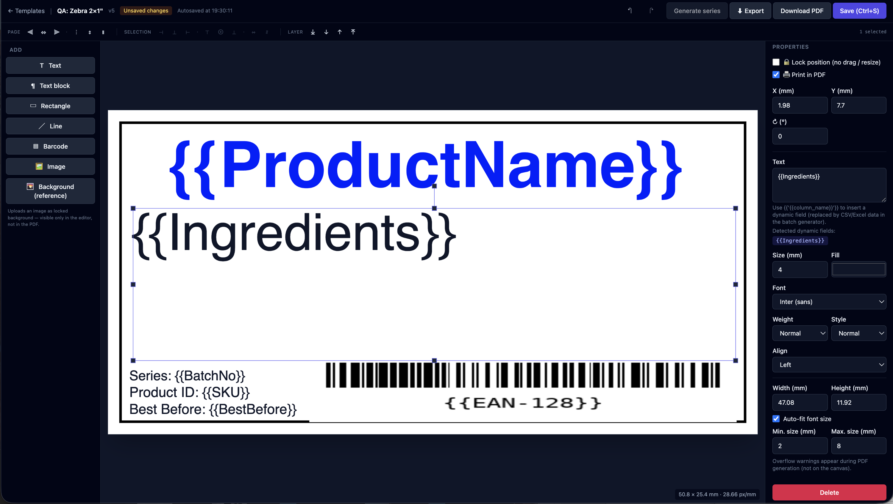
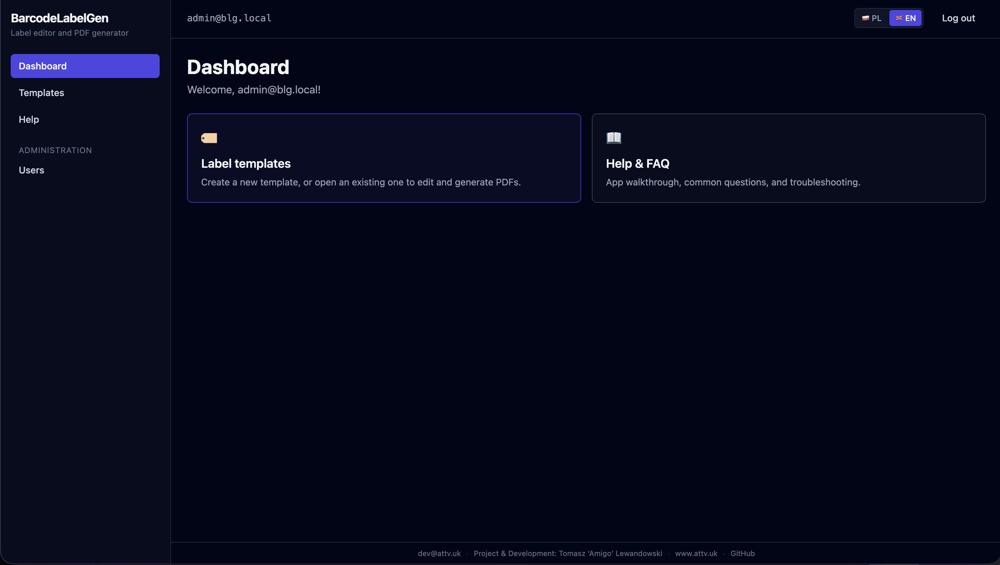
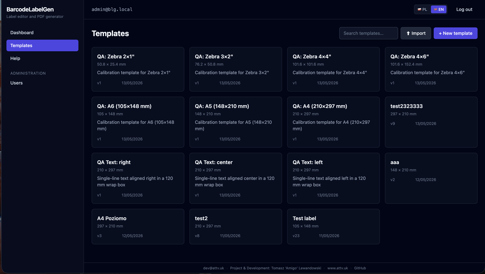
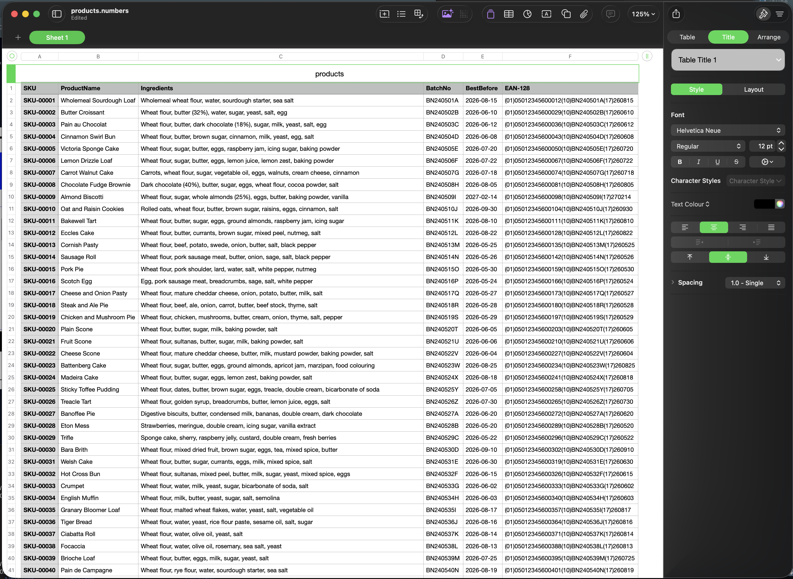
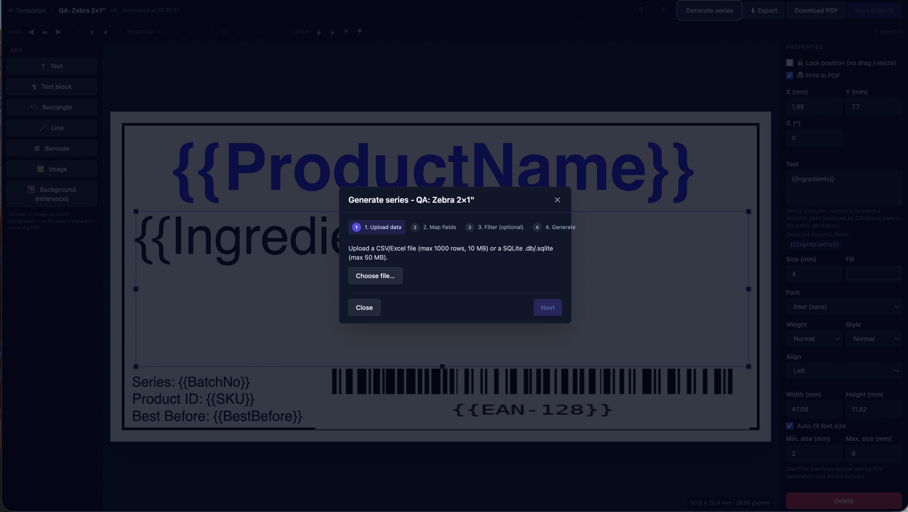
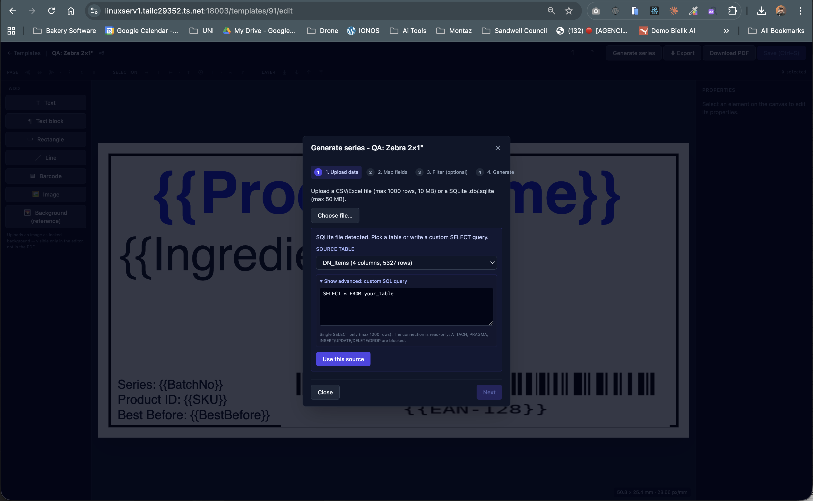
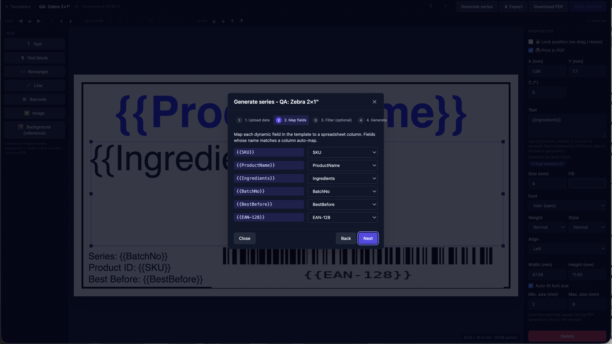
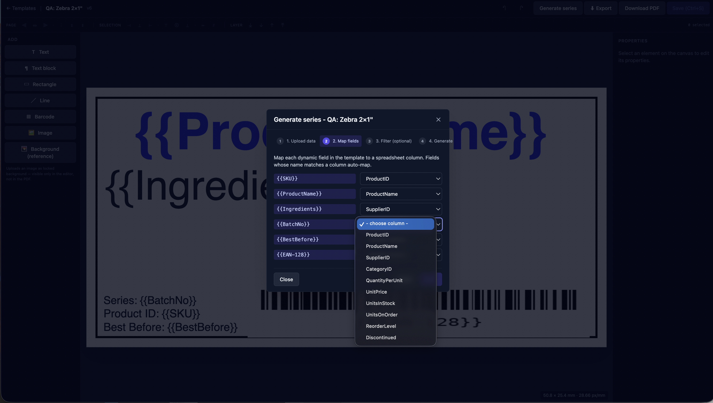
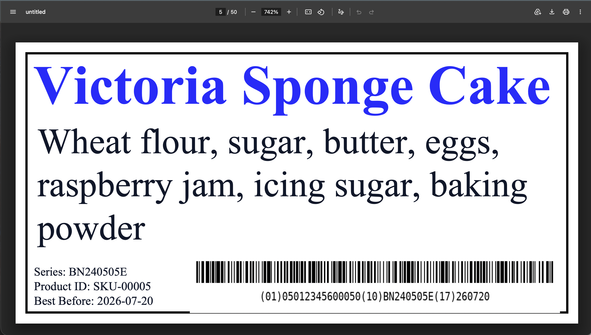
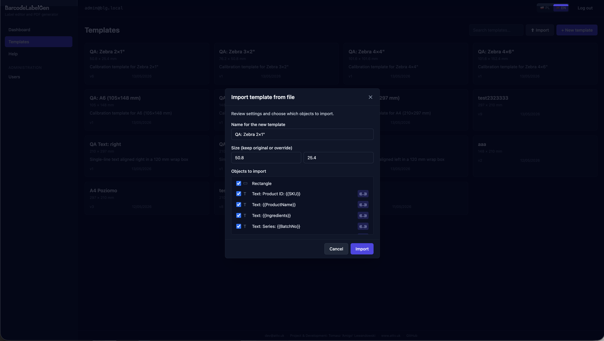

# BarcodeLabelGen

> Web-based label editor and PDF batch generator for non-technical office users.
> Self-hosted, multilingual (PL + EN), runs on a single Docker host behind Tailscale.



> The editor open on a Zebra 2×1″ template — text, dynamic `{{placeholders}}`, an EAN-128 barcode, all positioned in millimetres. Right panel shows the per-object inspector with Lock + Print-in-PDF toggles, font, size, alignment.

---

## What it does

- **Online label editor** — Konva-powered drag-and-drop canvas (text, text blocks with auto-fit, rectangles, lines, images, barcodes, dynamic `{{column}}` fields).
- **Lockable + non-printable objects** — pin a logo so it can't be moved; drop a scan of a pre-printed sheet as a layout reference that stays out of the final PDF.
- **Layer order + alignment + distribute** — z-stack controls (front/back/forward/backward), 6 page-relative + 6 selection-relative align operations, equal distribution.
- **Duplicate fast** — Alt+drag a selected object to clone it under the cursor; Ctrl/Cmd+D to duplicate in place. Multi-select supported.
- **Barcodes** — EAN-13, EAN-14, GTIN, Code 128, GS1-128, QR (with checksum validation).
- **Series generation** — upload a CSV, Excel, or **SQLite** file, map placeholders to columns (or write a custom SELECT), optionally filter rows, get a single PDF with one label per row. Up to 1,000 labels per batch.
- **Template import / export** — every template is a single self-contained `.blg-template.json` (size, objects, embedded images). Cross-instance portable; partial import lets you skip objects + override the size.
- **Multilingual UI + in-app docs** — Polish + English from day one, with HELP + FAQ rendered inside the app.
- **Roles** — admin / editor / viewer; admin manages users + temporary password resets.
- **Label formats** — A4, A5, A6, common Zebra sizes (4×6", 4×4", 3×2", 2×1"), plus arbitrary custom mm.

---

## Tour

### 1 · Dashboard



> First screen after signing in. Two cards point straight at the user's job: open the template editor, or read the in-app guide. Sidebar exposes Dashboard / Templates / Help / Administration → Users.

### 2 · Templates library



> Every template you (or a shared admin) own. Search filters by name; each tile shows the size + version + last-modified date. Hover a tile to reveal Export (⬇) and Delete (✕). Top-right pair: **Import** (from a `.blg-template.json` file) and **New template** (pick a format).

### 3 · Bring your data



> The "left side" of the mail-merge flow. Any CSV / Excel / SQLite with column headers works. Here: 60 products with `SKU`, `ProductName`, `Ingredients`, `BatchNo`, `BestBefore`, `EAN-128` — feeds straight into a template that uses `{{SKU}}`, `{{ProductName}}` etc.

### 4 · Generate Series — pick the source



> Step 1 of the 4-step wizard. Accept any of: `.csv`, `.xls`, `.xlsx` (max 10 MB / 1,000 rows) **or** `.db` / `.sqlite` / `.sqlite3` (max 50 MB).

### 5 · SQLite source — table picker + custom SELECT



> When the uploaded file is a SQLite database the wizard detects every user-visible table (sorted by row count — biggest first) and lets you either pick one or expand "Show advanced" to write a `SELECT` with `WHERE`/`JOIN`/`UPPER(...)` etc. Read-only connection; single-statement validator blocks `INSERT` / `UPDATE` / `DELETE` / `DROP` / `ATTACH` / `PRAGMA`; auto-LIMIT 1000.

### 6 · Map placeholders to columns



> Step 2 detects every `{{name}}` placeholder in the template and auto-maps it to a same-named column. Mismatched names are pickable from a dropdown — the wizard refuses to move on until every placeholder has a source.



> The fallback dropdown showing every column the source carries. Works the same whether the source was CSV, Excel, or a SQLite query.

### 7 · Per-row PDF output



> One PDF, one page per row. Each `{{placeholder}}` is replaced by the row's value — here `Victoria Sponge Cake` is row 5 of 60, with its own ingredients, batch number, and GS1-128 barcode. Long ingredients lists wrap inside the text block; the renderer reports a warning if anything doesn't fit.

📄 **[Download a sample PDF →](docs/screenshots/QA_Zebra_2_1__50.pdf)** (50 Zebra 2×1″ labels, 668 KB) — generated from the products dataset above, ready to inspect or print.

### 8 · Import / export templates



> Every template exports to a single `.blg-template.json` (size + objects + embedded images, all base64). The import modal lets you rename the new template, override the size, and **uncheck** specific objects to bring in — the `{{…}}` chip flags objects that carry dynamic placeholders. Duplicate images (detected by SHA-256) prompt a reuse-vs-copy choice.

---

## Tech stack

| Layer | Technology |
|---|---|
| Frontend | React 18 + TypeScript + Vite + Konva + TailwindCSS + react-router 7 + react-i18next + react-markdown |
| Backend | Python 3.12 + Flask 3 + uv + SQLAlchemy 2 + Alembic + ReportLab + python-barcode + qrcode + pandas + Pillow + pdfplumber |
| Database | PostgreSQL 16 (production) · SQLite (test fixture) |
| Cache + sessions + job queue | Redis 7 |
| Infrastructure | Docker + Docker Compose + nginx |
| Deployment | Linux host fronted by Tailscale Serve |
| Tests | pytest (backend, 172 tests) + tsc + eslint (frontend) |

---

## Quick start

```bash
# Clone
git clone https://github.com/AmigoUK/BarcodeLabelGen.git
cd BarcodeLabelGen

# Build + start (Postgres + Redis + Flask + nginx)
docker compose up -d

# First-time DB migration (auto-runs on web container start; explicit form below)
docker compose exec web alembic upgrade head

# Bootstrap an admin account (replace email + password)
docker compose exec web flask create-admin --email you@example.com --password 'change-me-now-please'

# Open in your browser
open http://127.0.0.1:18003
```

### Behind Tailscale (recommended for production)

The service binds to `127.0.0.1:18003` only — to expose it to your tailnet (and get a free `*.ts.net` HTTPS cert):

```bash
tailscale serve --bg --https=18003 http://127.0.0.1:18003
# → https://<your-machine>.<tailnet>.ts.net:18003
```

### Development with hot reload

```bash
docker compose -f compose.dev.yml up
# Vite dev server + Flask debug, proxied through nginx.
```

---

## Documentation

- 📖 **[`docs/HELP.pl.md`](docs/HELP.pl.md)** / **[`docs/HELP.en.md`](docs/HELP.en.md)** — full user guide (onboarding, every feature, troubleshooting). Same content is rendered in-app at `/help`.
- ❓ **[`docs/FAQ.pl.md`](docs/FAQ.pl.md)** / **[`docs/FAQ.en.md`](docs/FAQ.en.md)** — common questions + error message recovery.
- 📐 **[`docs/PROJECT.md`](docs/PROJECT.md)** — original MVP specification (PL).

---

## Project structure

```
BarcodeLabelGen/
├── backend/
│   ├── app/
│   │   ├── models/        # SQLAlchemy models
│   │   ├── routes/        # Flask blueprints (REST endpoints)
│   │   ├── schemas/       # Pydantic request/response models
│   │   ├── services/      # Business logic (PDF render, batch, datasets, …)
│   │   └── factory.py     # Flask app factory
│   ├── alembic/           # DB migrations (0001…0006)
│   ├── tests/             # pytest — 172 tests
│   └── pyproject.toml
├── frontend/
│   ├── src/
│   │   ├── components/    # Shared UI (Modal, Button, ImportTemplateModal, …)
│   │   ├── editor/        # Konva-based label editor (Canvas, panels, store)
│   │   ├── hooks/         # React-Query data hooks
│   │   ├── pages/         # Route components (Dashboard, Templates, Editor, Help, …)
│   │   ├── i18n/locales/  # PL + EN
│   │   └── lib/           # api client, csrf, download helper
│   └── package.json
├── docs/
│   ├── HELP.{pl,en}.md    # User guide (rendered in-app)
│   ├── FAQ.{pl,en}.md     # FAQ (rendered in-app)
│   ├── PROJECT.md         # MVP specification
│   └── screenshots/       # Images referenced from this README
├── compose.yml            # Production docker-compose
└── README.md              # ← you are here
```

---

## Status

✅ **Production** on a Tailscale-only host.
- Backend: 172 / 172 tests passing.
- QA harness (PDF render geometry checks): all formats ✅.
- Frontend: typecheck + lint + build clean; bundle 153 KB (gzipped 47 KB) main + lazy chunks for editor (Konva) and help (react-markdown).

---

## Credits

**dev@attv.uk · Project & Development: Tomasz 'Amigo' Lewandowski · [www.attv.uk](https://www.attv.uk) · [GitHub](https://github.com/AmigoUK/BarcodeLabelGen)**

## License

GPL-3.0 — see [`LICENSE`](LICENSE).
