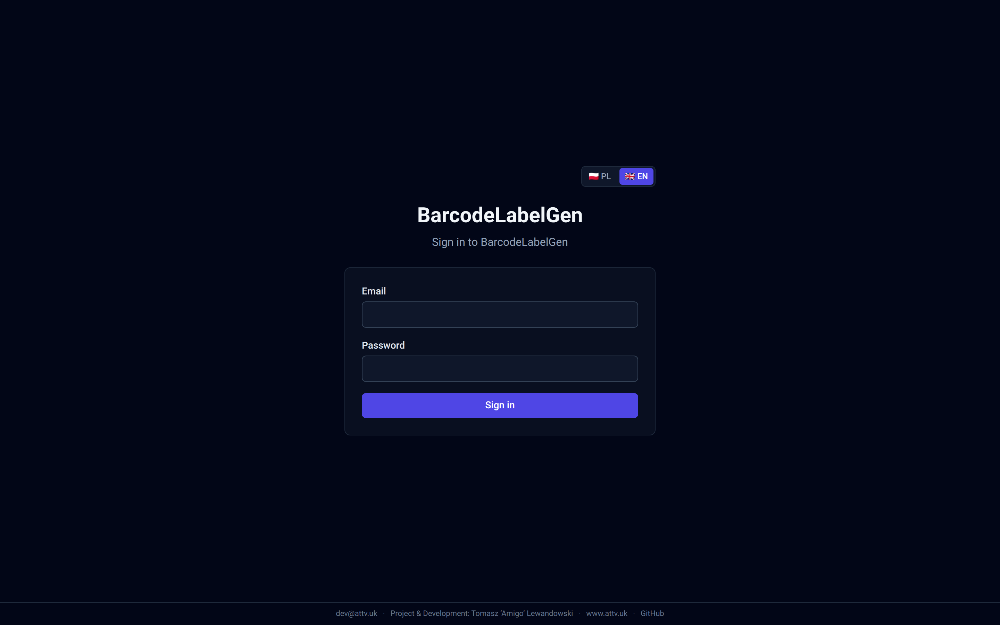
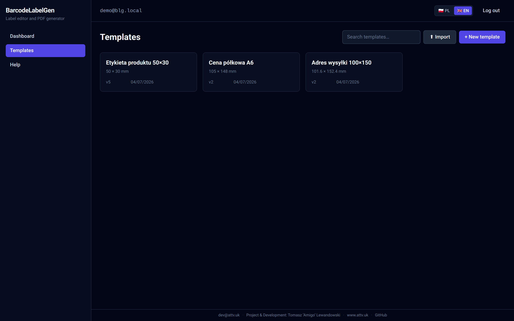
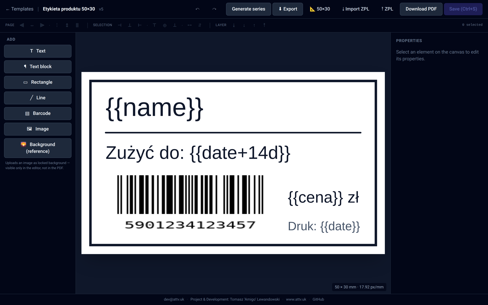
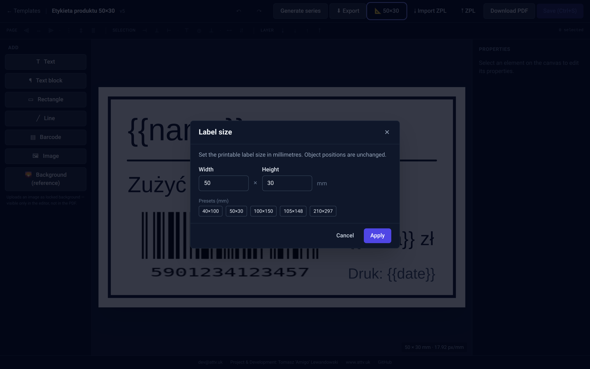
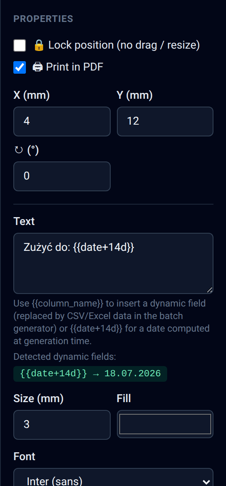
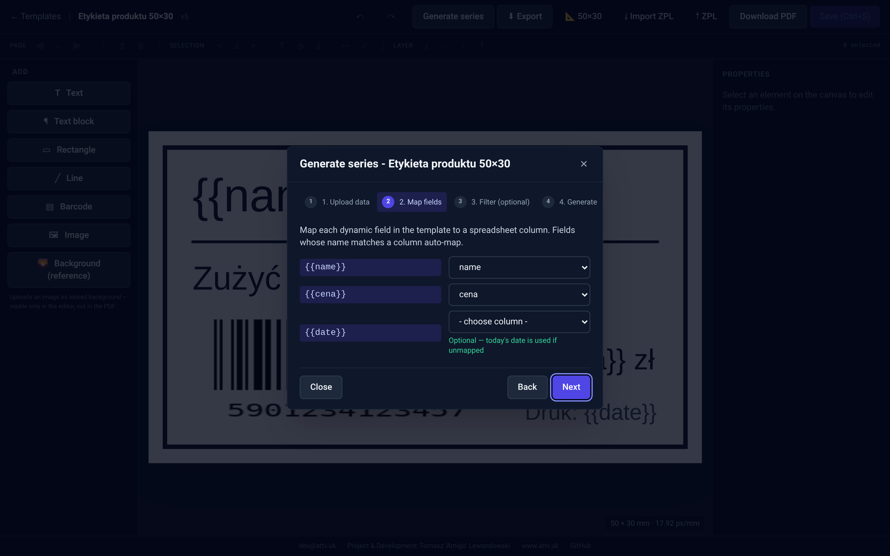
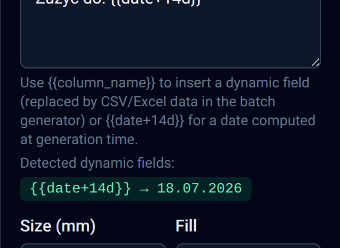
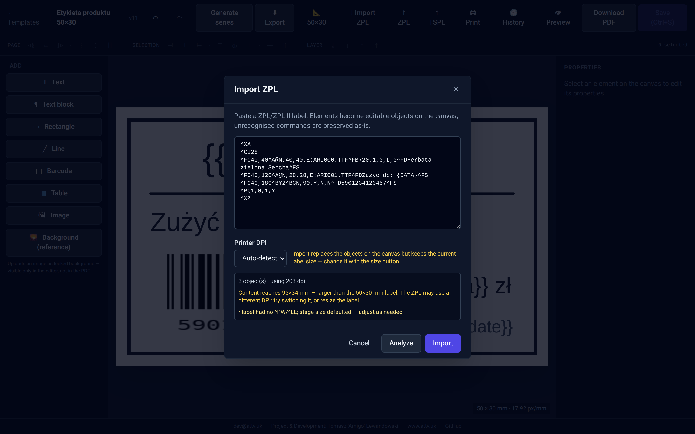
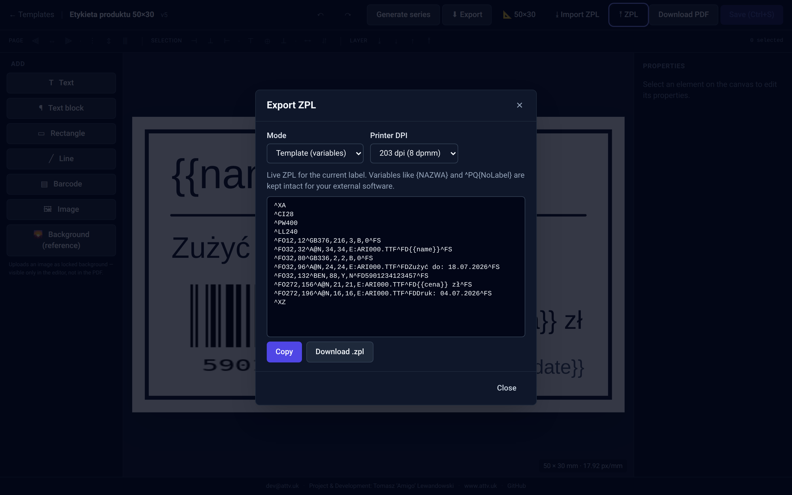
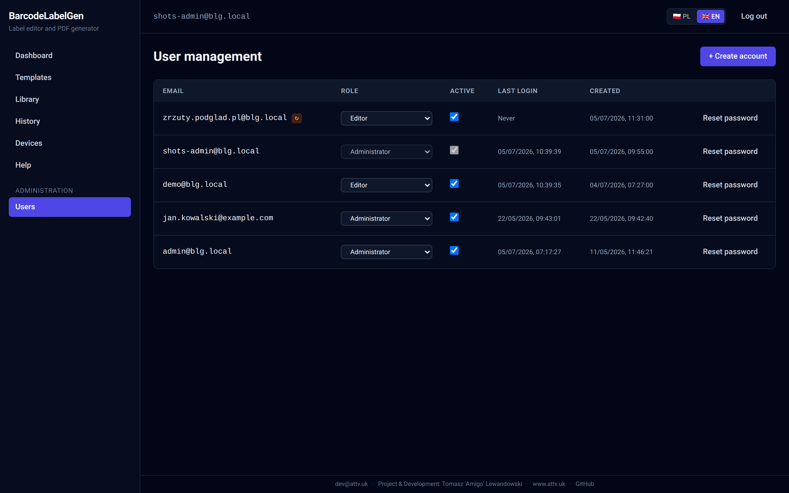

# BarcodeLabelGen — Help

A short guide to the app. Read top-to-bottom for a complete tour, or jump straight to the feature you need.

---

## 1. Getting started

### Signing in

1. Open the app URL in your browser.
2. Enter the email and password your administrator gave you.
3. On your first login, the app will ask you to set your own password (minimum 10 characters). This happens once — afterwards you go straight to the dashboard.



*frame: the Email + Password form with the "Log in" button and the PL/EN language switcher in the top-right corner.*

### The dashboard

After signing in you land on the **Dashboard**. It's just a welcome screen — to start working, click **Templates** in the left menu.

### Creating your first template

1. **Templates** → **New template**.
2. Enter a name (e.g. "Product price tags").
3. Pick a label format:
   - **Predefined** — ready-made sizes (A4, Zebra 2×1″, etc.).
   - **Custom size** — type width and height in mm and pick orientation.
4. Click **Create** — the editor opens.

---

## 2. Menus and navigation

### Left sidebar

| Item | What's there |
|---|---|
| **Dashboard** | Welcome screen. |
| **Templates** | Your templates organised in folders + the *New template* and *Import* buttons. |
| **Library** | Ready-made starter projects + templates shared by other users (section 2a). |
| **Devices** | Print connectors and the Inbox of captured labels (section 7a). |
| **Help** | This guide + the FAQ, without leaving the app. |
| **Administration → Users** | (admin only) account management. |

In the header, on the right: your email, the **PL/EN** language switcher and the **Log out** button.



*frame: the Templates page with a few tiles, the search field, and the "Import" and "New template" buttons in the top-right corner.*

### The editor — screen layout

When you open a template you'll see:

- **Toolbar (top)** — Save, Undo/Redo, autosave indicator, **Generate series**, **⬇ Export** (template file), **📐 label size**, **⤓ Import ZPL**, **⤒ ZPL** (export), **Download PDF**.
- **Left panel (Add)** — buttons for inserting objects onto the label.
- **Canvas (center)** — your label at 1:1 scale (millimetres).
- **Alignment bar (above canvas)** — alignment and z-order controls.
- **Right panel (Properties)** — settings for the selected object.



*frame: the whole editor with a template open; arrows labelling the toolbar, the Add panel, the canvas, the alignment bar and the Properties panel.*

### Alignment bar — what each group does

- **Page** — aligns objects to a page edge or the page center.
- **Selection** — aligns objects relative to each other (needs ≥2 selected).
- **Layer** — moves selected objects forward/back in the z-stack.
- **Distribute** (3+ objects) — equal spacing horizontally/vertically.

Hover any icon for a tooltip.

---

## 2a. Folders, the Library and sharing

### Folders — keeping your own templates tidy

On the **Templates** page there's a folder rail on the left: **All**, your folders (with counters) and **No folder**. Folders are **private** — every user has their own.

- **New folder** — button at the bottom of the rail.
- **Moving templates**: hover a template card → **⚙** → pick a folder → Save.
- **Edit folder (✎)** — rename and pick a **folder color** (8-color palette): a colored dot appears next to the folder in the rail and on its template cards.
- **Delete (✕)** — **does not delete the templates**, they go back to "No folder".

### The Library — ready-made projects and templates from others

The **Library** menu item has two sections:

- **Ready-made projects** — built-in starters (product label with EAN and date, shipping address, shelf price, best-before date, warehouse label with QR, asset sticker).
- **From users** — templates that others have shared (you can see the author).

The **"Use"** button always creates **your own copy** and opens it in the editor — you can't break the original.

### Sharing your own template

Templates → hover a card → **⚙** → tick **"Share in the Library"**. In the same dialog you can also upload a **featured image** — a preview picture shown on the list card and in the Library. From then on every logged-in user can see it in the Library and clone it; **only you can edit it**. A shared template shows a 📚 icon in the list. Untick to withdraw it from the Library.

---

## 3. Building a label — object guide

Everything below lives in the **left panel**, *Add* section.

### T — Text

**What it does:** A single line of fixed-size text.
**When to use:** Headers, short labels, fixed strings.
**How:** Click **T Text**, then select it on the canvas and edit content in the right panel.

### ¶ — Text block

**What it does:** Multi-line text that wraps inside a frame; optional *auto-fit* scales the font up/down to fit.
**When to use:** Variable-length product descriptions (perfect for `{{description}}` from a spreadsheet).
**How:** Click **¶ Text block**. In the right panel tick **Auto-fit font** and set min/max size.

### ▭ — Rectangle, ╱ — Line

**What it does:** Helper geometry (frames, separators).
**How:** Click → drag on the canvas to size; set fill/stroke in the right panel.

### ▤ — Barcode

**What it does:** Renders a barcode from the value you give it.
**When to use:** Any product catalog with codes.
**How:** Click **▤ Barcode**, in the right panel pick the type (EAN-13, Code128, etc.) and enter the data. You can use `{{sku}}` to pull the value from a spreadsheet column.

### ▦ — Table

**What it does:** A rows×columns grid with text in each cell — for property–value labels, nutrition facts, a mini list of items.
**How:** Click **▦ Table**. In the right panel set the number of rows/columns, type the cell contents (you can use `{{column}}` and `{{date+x}}` — chips appear below the grid), set the column widths in mm, the font and the border. Tick **Bold header** to emphasise the first row.
**Printing:** the table renders natively in the PDF and is emitted as native ZPL (`^GB` frame + cell text). Note: table rotation is not supported in ZPL (it exports without rotation).

### 🖼 — Image

**What it does:** Uploads a PNG/JPG/SVG and places it on the canvas. Prints in the PDF.
**When to use:** Logos, illustrations, icons, product photos.
**How:** Click **🖼 Image** → pick a file. Up to 5 MB.

### 🌄 — Background (reference)

**What it does:** Uploads an image as a **locked, full-canvas background** that's **visible in the editor only and is NOT printed in the PDF**.
**When to use:** Your labels arrived from the print shop with a logo already pre-printed. You scan a sample, upload it as background, position the new text against it, and generate the PDF — the printer overlays only the new text, the logo isn't double-printed.
**How:** Click **🌄 Background**, pick a file. The background drops to the bottom of the stack, locked (no handles). To change: select it, then in the right panel uncheck **Lock position** or check **Print in PDF**.

---

## 4. Working with objects

### Selecting

- Single click = select one.
- **Shift + click** = add to selection (multi-select).
- **Ctrl/Cmd + A** = select everything.

### Moving and resizing

- Drag the selected object with the mouse.
- Corner handles = resize; the handle above the object = rotate.
- A **locked** object has no handles — but you can still click it to unlock from the right panel.

### Undo / redo

- **Ctrl/Cmd + Z** = undo.
- **Ctrl/Cmd + Shift + Z** or **Ctrl/Cmd + Y** = redo.

One operation = one history step (e.g. aligning 5 objects undoes in a single Ctrl+Z).

### Duplicating

Two quick ways to clone the selected object (or a whole multi-selection):

- **Alt + drag** — hold **Alt** (or **Option** on Mac) and drag a selected object. The original stays put; a clone lands wherever you release. With multi-select the clones keep their relative positions — drag one of three selected items and you get three clones offset together at the drop point.
- **Ctrl/Cmd + D** — duplicate in place with a small offset (+5 mm right and down). Selection jumps to the clones, so a follow-up Ctrl+D stacks neatly down-right.

The clone inherits everything: font, colour, rotation, the *Lock* / *Print in PDF* flags. Images share the same Asset (one binary → many objects). A multi-select duplication is one Ctrl+Z away.

### Layer order (z-order)

In the **alignment bar**, **Layer** group:

- ⤓ **Send to back** — push selected under everything else.
- ↓ **Send backward** — move down by one neighbour.
- ↑ **Bring forward** — move up by one neighbour.
- ⤒ **Bring to front** — over everything.

Multi-select keeps the relative order of the selected items.

### Lock + Print in PDF (right panel)

Every object's right panel has two checkboxes at the top:

- **🔒 Lock position** — disables drag and resize (you can still edit font, colour, etc.).
- **🖨 Print in PDF** — checked by default. Unchecked = visible only in the editor; the renderer skips it in the PDF. Non-printable objects appear at 50% opacity so you spot them at a glance.

### Autosave

The editor saves every few seconds on its own. Status sits in the toolbar:
- **Unsaved changes** — something is pending.
- **Autosaving…** — sending now.
- **Autosaved at 12:34** — last successful save.

You can also click **Save** manually.

### Version history

Every **manual** save (the **Save** button or **Ctrl+S**) creates a template version. Autosave overwrites the current state and does **not** clutter the history. The **🕘 History** toolbar button lists the versions (number, date, author) — click **Restore** to go back to the one you want. Restoring saves the current state as a new version ("restored from vN"), so it is reversible. The app keeps the last 30 versions per template.

### Changing the label size

The size you picked when creating the template **can be changed at any time**: click the **📐 {width}×{height}** button in the toolbar.

- Type a new width and height in mm (1–1000), or click one of the ready-made presets (40×100, 50×30, 100×150, 105×148, 210×297).
- Objects are **not rescaled** — they keep their positions in mm. If you shrink the label, just drag any elements that ended up past the edge back in.



*frame: the modal with the Width/Height fields and the row of preset chips; cursor hovering the "Apply" button.*

---

## 5. Downloading a PDF — single label

Click **Download PDF** in the editor toolbar. Rendering is synchronous (a few seconds), then the PDF downloads automatically.

If any text didn't fit its block, you'll see an **N warnings** chip — hover it for details.

Column placeholders (`{{name}}`) stay as literal text in a single PDF — data only gets substituted during series generation. **Date placeholders** (`{{date+14d}}`, see section 7), on the other hand, are calculated here too.

---

## 6. Generating a series — many labels from one template

This is the app's flagship feature. It lets you generate, say, 200 labels from one template, where each gets different data from a spreadsheet or database.

### Step 0 — prep the template

In a Text or Barcode object, insert a placeholder shaped like `{{column_name}}`, e.g.:
- Text: `{{name}}`
- Barcode data: `{{sku}}`

Each occurrence will be replaced with the value from the matching column.



*frame: the right Properties panel with a text field containing `{{name}}` and `{{date+14d}}`; below it two chips — a purple `{{name}}` and a green `{{date+14d}} → 18.07.2026`.*

### Step 1 — Upload data

Toolbar → **Generate Series** → Step 1 (Upload data).

Accepted formats:

| Format | Max size | Max rows |
|---|---|---|
| `.csv` | 10 MB | 1,000 |
| `.xls` / `.xlsx` | 10 MB | 1,000 |
| `.db` / `.sqlite` / `.sqlite3` | 50 MB | 1,000 (per query) |

#### CSV / Excel

The file uploads and is parsed immediately. You'll see the columns and row count. Click **Next**.

#### SQLite

After upload the app shows a **table list** (sorted with most-rows-first). Pick a table that has data and click **Use this source**.

If you need SQL-level filtering (e.g. only products in a specific category, or a JOIN across tables), expand **Show advanced** and write a SELECT, e.g.:

```sql
SELECT sku, name, price
FROM products
WHERE category = 'labels' AND price > 0
```

**Security:** The connection is read-only. Only a single SELECT is accepted — `INSERT`, `UPDATE`, `DELETE`, `DROP`, `ATTACH`, `PRAGMA` are blocked. Up to 1,000 result rows — anything larger is rejected with a request to add `WHERE`/`LIMIT`.

### Step 2 — Map fields

The app detects every `{{...}}` placeholder in the template. If the placeholder name matches a column name exactly, it auto-maps. Otherwise, pick the column manually.

### Step 3 — Filter (optional)

Drop rows before generating, e.g. *price > 10* or *category contains "tea"*. Click **Test filter** to see how many rows match. Skip this step to keep all rows.



*frame: step 2 of the wizard with the placeholder list on the left and column selects on the right; next to `{{date}}` a green hint reading "Optional — today's date is used when unmapped".*

### Step 4 — Generate PDF

Click **Generate PDF**. A background job starts; a progress bar updates live. When it's done, the PDF downloads automatically.

If any labels had text overflowing their blocks, you'll see a warning list (which row, which object) — the PDF is still produced.

---

## 7. Date placeholders — `{{date+…}}`

Besides spreadsheet columns you can insert **dates calculated automatically at generation time** — perfect for best-before ("use by") and production dates. They work everywhere: in a single PDF, in a series and in the ZPL export.

### Syntax

| You type | You get (when generating on 04.07.2026) |
|---|---|
| `{{date}}` | 04.07.2026 (today's date) |
| `{{date+14d}}` | 18.07.2026 (+14 days) |
| `{{date-7d}}` | 27.06.2026 (−7 days) |
| `{{date+3m}}` | 04.10.2026 (+3 months) |
| `{{date+1y}}` | 04.07.2027 (+1 year) |
| `{{date+14d:DD/MM/YY}}` | 18/07/26 (custom format) |
| `{{date+3m:YYYY-MM-DD}}` | 2026-10-04 |

- Offset units: **d** = days, **m** = months, **y** = years; both `+` and `-` work.
- The format (optional, after the colon) is built from the **DD**, **MM**, **YY**, **YYYY** building blocks — separators (dots, slashes, dashes, spaces) pass through unchanged. Without a format you get `DD.MM.YYYY`.
- Month ends are safe: 31 January + 1 month = 28/29 February (never "31 February").

### How do you know it will work?

Once you type the placeholder, a **green chip previewing the calculated date** appears in the right panel (purple chips are regular spreadsheet columns). Hover the chip — a tooltip reminds you that the final value is calculated at generation time.



*frame: close-up of the right panel; the Content field with `{{date+14d}}` and the green chip `{{date+14d}} → 18.07.2026` underneath.*

### Good to know

- A **column named `date`** in your spreadsheet wins for a bare `{{date}}` — forms with an offset (`{{date+14d}}`) are always calculated automatically.
- The date is calculated **at PDF/ZPL generation time**, using the server clock — not when you save the template.
- In the series wizard, date fields **don't need to be mapped** to a column.

---

## 7a. ZPL — Zebra label printers

**ZPL** is the language of label printers (Zebra and compatibles). The app works in both directions: it can import an existing ZPL label into the editor and export your design as ZPL.

### Importing ZPL

Toolbar → **⤓ Import ZPL**.

1. Paste the ZPL code (e.g. from another system or from your label supplier).
2. Pick the **Printer DPI** — if you don't know it, leave **Auto-detect** (the app compares the dimensions in the code with your label size).
3. Click **Analyze** — you'll see the number of recognised objects and the detected DPI; if the label in the code is bigger than yours, you get a hint.
4. Click **Import** — the objects land on the canvas. **Careful:** the import replaces the current label content.

Printer variables in single braces (e.g. `{NAZWA}`) pass through untouched, and commands the editor doesn't model are preserved and come back on export.



*frame: the modal with ZPL code pasted in, the DPI select set to "Auto-detect" and the analysis result "12 objects · 203 dpi".*

### Exporting ZPL

Toolbar → **⤒ ZPL**. Two modes:

- **Template (variables)** — one ZPL code built from your design; column placeholders `{{...}}` stay in the code (you substitute them in your own system), while **date placeholders are calculated right away**. **Copy** and **Download .zpl** buttons.
- **Batch (dataset)** — pick a previously uploaded data file and the app generates one `.zpl` file with a label for every row (columns and dates both substituted).

Pick the DPI that matches your printer (203 or 300).



*frame: the modal in "Template (variables)" mode with a preview of the generated code and the Copy / Download .zpl buttons.*

### Direct printing — the connector

Instead of downloading a `.zpl` file, you can print **straight from the editor** with the **🖨 Print** button:

1. On a computer on the same network as your printers, install the **blg-connector** agent (binary in the Assets of every GitHub release; configuration: `connector/README.md`).
2. In the app: **Devices → Add device** → copy the token into the agent's `config.yaml`. The device switches to **Online** and reports its list of printers.
3. In the editor: **🖨 Print** → pick the device, printer, number of copies and DPI → **Print**. The dialog shows the progress: *queued → agent picked it up → printed* (or an error with the reason).

**Fast path:** if the connector runs **on the same computer** as your browser, the dialog detects it automatically and shows a preselected **⚡ This computer — instant print** option — the label then goes straight to the printer, skipping the server round-trip.

Date placeholders are calculated at print time; column placeholders stay in the code (this prints a single label, not a series).

### Virtual printer — capture labels from other programs

The connector can also work **the other way round**: it pretends to be a network printer, and anything other applications (an ERP, Word, a legacy warehouse program) print to it lands in the **Inbox** on the **Devices** page.

1. In the agent's `config.yaml`, enable the `capture` section (step-by-step instructions, including the Windows printer setup: `connector/README.md`).
2. Print something from any application to that virtual printer.
3. **Devices → Inbox** → **Open in editor** — the label becomes a regular template: size detected from the code, texts and barcodes editable.

From the Inbox you can also copy the raw ZPL code or delete an entry. The app keeps at most the 200 most recent captures per device.

---

## 8. Administration (admin only)

Left menu → **Administration → Users**.



*frame: the users table with the Email / Role / Active / Last login columns and the "Create account" button at the top.*

### Creating a user

1. Click **Create account**.
2. Enter email + temporary password (minimum 10 characters; you can generate a random one).
3. Pick a role:
   - **Administrator** — full access plus user management.
   - **Editor** — creates/edits their own templates and datasets.
   - **Viewer** — can open and view, but doesn't save.
4. After clicking *Create*, the temporary password is shown **once** — pass it to the user.

### Resetting a password

Click **Reset password** next to the account → generate a new temporary one → hand it over. The user is forced to change it on next login.

### Activating / deactivating

Toggle **Active** on the row. You cannot deactivate your own account (safety check).

---

## 8a. Importing / exporting templates

You can save any template as a single `.blg-template.json` file (label size + every object's position + content + bundled images). The file is portable: archive it, mail it, or import it into another BarcodeLabelGen instance.

### Export

Two entry points:
- **Templates** → hover a template tile → **⬇** icon in the bottom-right corner.
- Editor toolbar → **⬇ Export** button (next to *Download PDF*).

You get a `<name>.blg-template.json` — keep it somewhere safe as a backup.

### Import

**Templates** → **⬆ Import** opens a 2-step modal:

1. **Pick a file** — choose your `.blg-template.json`. The app validates it and shows a preview.
2. **Configure** — you can:
   - change the **name** of the new template (default is the name from the file; on collision a "(kopia)" suffix is appended automatically),
   - **override the size** (leave blank = keep original),
   - **uncheck objects** you don't want to bring in (checklist with type icons + short content preview),
   - for every **duplicate image** decide: *Reuse existing* (save space) or *Create new copy*.

Click **Import** → a new template is created and opens in the editor.

### Typical workflows

- **Backup before a big change** — export, archive the file, edit freely. Something broke → re-import.
- **Clone a layout to a different size** — export, import with size override (e.g. same label for A6 and 100×50 mm).
- **Move a template between instances** (dev → prod) — export on one side, import on the other.
- **Partial import** — take the barcode block + a couple of fields from a finished template and uncheck the rest.

### Limits and safety

- Max 20 MB file, 50 objects, 20 images (5 MB each).
- Images are integrity-checked: sha256 must match the base64 payload. Tampered files are rejected.
- The new template always belongs to your account, regardless of who exported the file.

## 9. Keyboard shortcuts

| Shortcut | Action |
|---|---|
| Ctrl/Cmd + S | Save |
| Ctrl/Cmd + Z | Undo |
| Ctrl/Cmd + Shift + Z | Redo |
| Ctrl/Cmd + A | Select everything (in the canvas) |
| Ctrl/Cmd + D | Duplicate selection (+5 mm offset) |
| Alt + drag | Duplicate selection at the drop point |
| Delete / Backspace | Delete selected |
| Shift + click | Add to selection |

---

## 10. Support

Maintained by **Tomasz "Amigo" Lewandowski** — contact: dev@attv.uk · www.attv.uk.

Source: github.com/AmigoUK/BarcodeLabelGen
