# BarcodeLabelGen — Pomoc

Ten przewodnik pomoże Ci poznać program krok po kroku — nawet jeśli nigdy wcześniej nie używałaś/eś podobnego narzędzia. Możesz czytać po kolei od góry albo od razu przejść do sekcji, która Cię interesuje.

Jeśli czegoś tu zabraknie, zajrzyj też do [FAQ](FAQ.pl.md) albo napisz na **dev@attv.uk**.

---

## 1. Pierwsze kroki

### Logowanie

1. Otwórz adres aplikacji w przeglądarce (dostajesz go od administratora).
2. Wpisz swój email i hasło, które dał Ci administrator.
3. Kliknij **Zaloguj**.


*kadr: formularz Email + Hasło z przyciskiem „Zaloguj" i przełącznikiem języka PL/EN w prawym górnym rogu.*

4. Jeśli logujesz się **pierwszy raz**, program poprosi Cię o ustawienie własnego hasła (minimum 10 znaków). To zdarza się tylko raz — przy kolejnych logowaniach od razu zobaczysz swój panel.

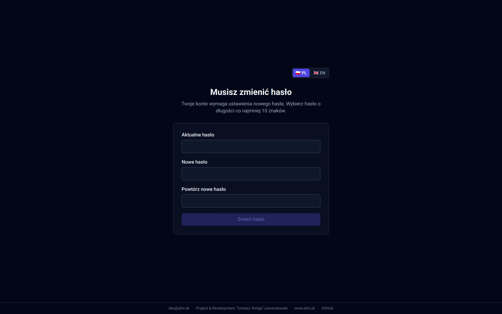

### Pulpit — ekran startowy

Po zalogowaniu widzisz **Pulpit**. To tylko ekran powitalny — nie musisz tu nic ustawiać. Żeby zacząć pracę, kliknij **Szablony** w menu po lewej stronie.

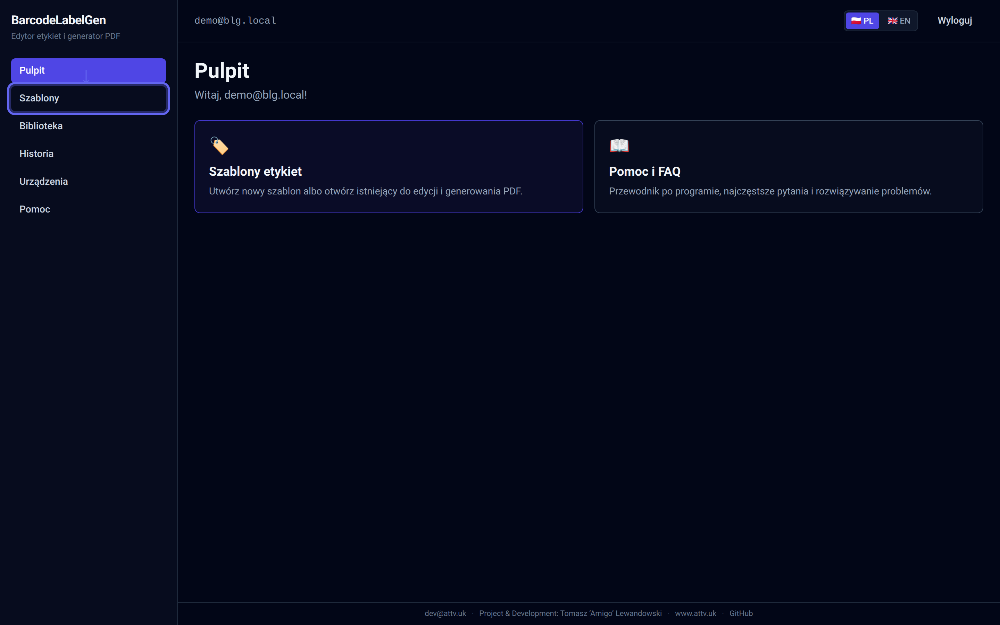

### Tworzenie pierwszego szablonu

**Szablon** to Twój projekt etykiety — robisz go raz, a potem możesz go używać wielokrotnie (np. za jednym razem wydrukować 200 różnych produktów).

1. Kliknij **Szablony** w lewym menu.
2. Kliknij przycisk **Nowy szablon** w prawym górnym rogu.


3. Wpisz nazwę szablonu, np. „Cennik produktów".
4. Wybierz format etykiety:
   - **Predefiniowane** — gotowe, popularne rozmiary (A4, Zebra 2×1″ itd.). Wybierz to, jeśli nie masz pewności, jakiego rozmiaru potrzebujesz.
   - **Własny rozmiar** — wpisz szerokość i wysokość w milimetrach i wybierz orientację (pionowa/pozioma). Wybierz to, jeśli Twoje etykiety mają niestandardowy rozmiar.

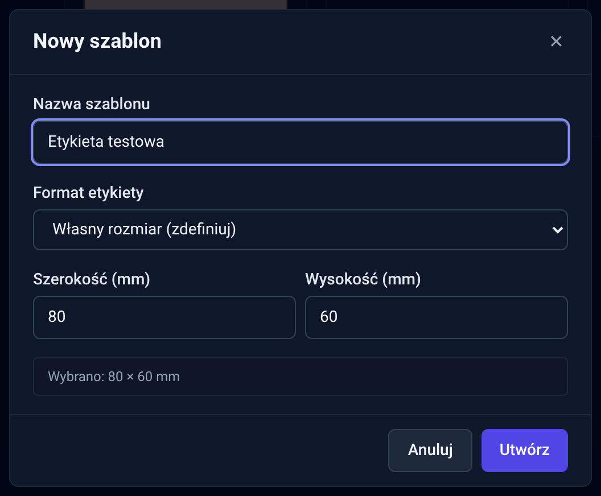

5. Kliknij **Utwórz**. Otworzy się edytor — możesz od razu zacząć projektować etykietę.

---

## 2. Menu i nawigacja

### Lewe menu (sidebar)

| Pozycja | Co tu znajdziesz |
|---|---|
| **Pulpit** | Ekran startowy. |
| **Szablony** | Twoje szablony, poukładane w folderach, plus przyciski *Nowy szablon* i *Importuj*. |
| **Biblioteka** | Gotowe projekty na start oraz szablony udostępnione przez innych (sekcja 2a). |
| **Urządzenia** | Konektory druku i skrzynka przechwyconych etykiet (sekcja 7a). |
| **Pomoc** | Ten przewodnik + FAQ — bez wychodzenia z programu. |
| **Administracja → Użytkownicy** | (tylko dla administratora) zarządzanie kontami. |

W nagłówku po prawej stronie znajdziesz: swój email, przełącznik języka **PL/EN** i przycisk **Wyloguj**.


*kadr: strona Szablony z kilkoma kafelkami, polem wyszukiwania oraz przyciskami „Importuj" i „Nowy szablon" w prawym górnym rogu.*

### Edytor — układ ekranu

Po otwarciu szablonu zobaczysz pięć obszarów ekranu:

- **Pasek narzędzi (góra)** — Zapisz, Cofnij/Ponów, informacja o autozapisie, **Generuj serię**, **⬇ Eksportuj** (plik szablonu), **📐 rozmiar etykiety**, **⤓ Importuj ZPL**, **⤒ ZPL** i **⤒ TSPL** (eksport dla drukarek etykiet — więcej w sekcji 7a), **Pobierz PDF**.
- **Lewy panel („Dodaj")** — przyciski do wstawiania obiektów na etykietę (tekst, kod kreskowy, obraz itd.).
- **Canvas (środek)** — Twoja etykieta w skali 1:1, w milimetrach — to, co widzisz, odpowiada rzeczywistemu rozmiarowi wydruku.
- **Pasek wyrównania (nad canvasem)** — wyrównywanie obiektów i zmiana ich kolejności.
- **Prawy panel („Właściwości")** — ustawienia obiektu, który akurat zaznaczyłaś/eś.


*kadr: cały edytor z otwartym szablonem; podpisane strzałkami: pasek narzędzi, panel Dodaj, canvas, pasek wyrównania, panel Właściwości.*

### Pasek wyrównania — co robi która grupa przycisków

- **Strona** — wyrównuje zaznaczony obiekt do krawędzi lub środka strony.
- **Zaznaczenie** — wyrównuje obiekty względem siebie (potrzeba co najmniej 2 zaznaczonych).
- **Warstwa** — zmienia, który obiekt jest z przodu, a który z tyłu (więcej w sekcji 4).
- **Rozłóż** — równe odstępy między obiektami w poziomie lub w pionie (potrzeba co najmniej 3 zaznaczonych).

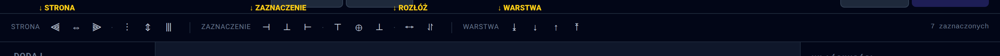

Każda ikona ma podpowiedź — najedź na nią myszką, a zobaczysz, co robi.

---

## 2a. Foldery, Biblioteka i udostępnianie

### Foldery — porządek we własnych szablonach

Na stronie **Szablony**, po lewej stronie, masz pasek folderów: **Wszystkie**, Twoje foldery (z liczbą szablonów w każdym) i **Bez folderu**. Foldery są **prywatne** — każdy użytkownik widzi tylko swoje.

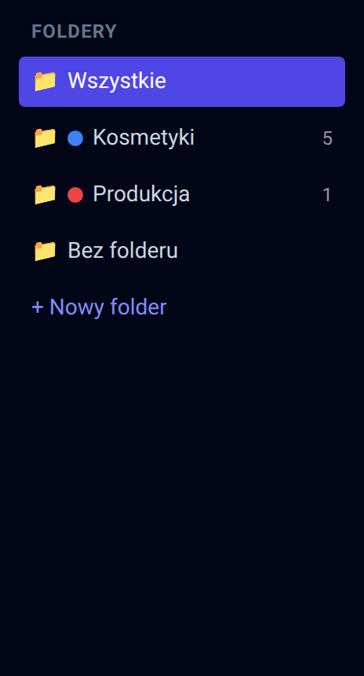

1. Aby założyć nowy folder, kliknij **Nowy folder** na dole paska.
2. Aby przenieść szablon do folderu: najedź myszką na jego kafelek, kliknij ikonę **⚙**, wybierz folder z listy i kliknij **Zapisz**.

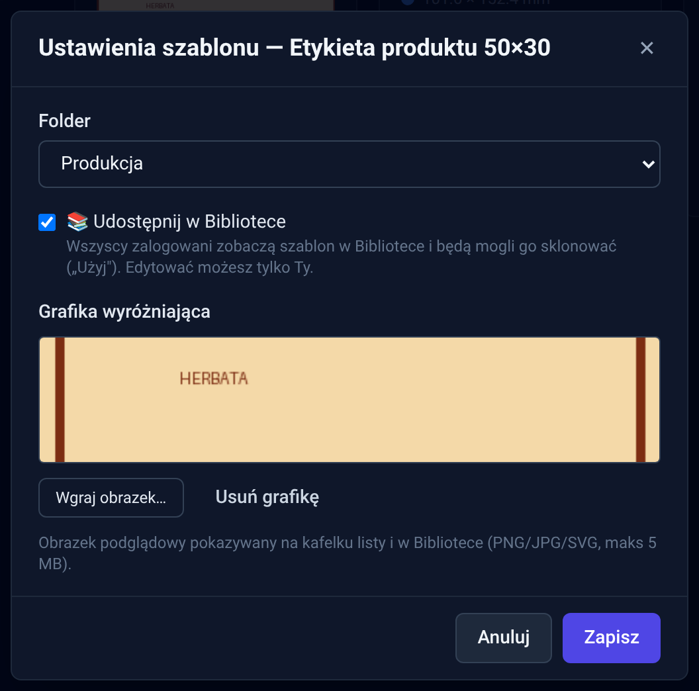

3. Aby zmienić nazwę lub kolor folderu, kliknij ikonę **✎** przy folderze. Do wyboru masz 8 kolorów — kolorowa kropka pojawi się przy folderze na pasku i na kafelkach jego szablonów.

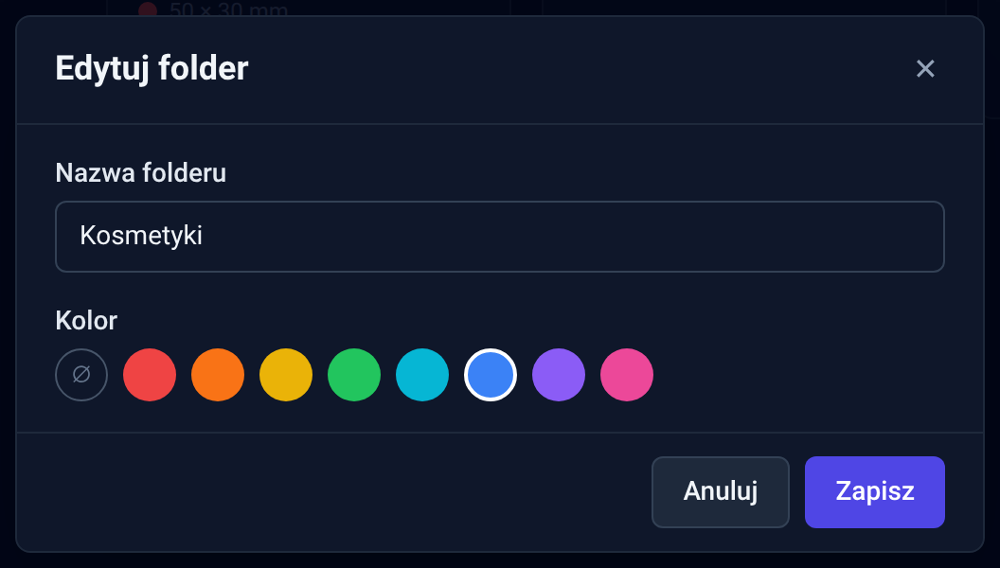

4. Usunięcie folderu (ikona **✕**) **nie kasuje szablonów** — po prostu wracają do „Bez folderu".

### Biblioteka — gotowe projekty i szablony od innych

Pozycja **Biblioteka** w menu ma dwie sekcje:

- **Gotowe projekty** — przygotowane wzory na start: etykieta produktu z kodem EAN i datą, adres wysyłki, cena półkowa, termin przydatności, etykieta magazynowa z kodem QR, naklejka inwentarzowa.
- **Od użytkowników** — szablony, które udostępnili inni użytkownicy (widzisz, kto jest autorem).

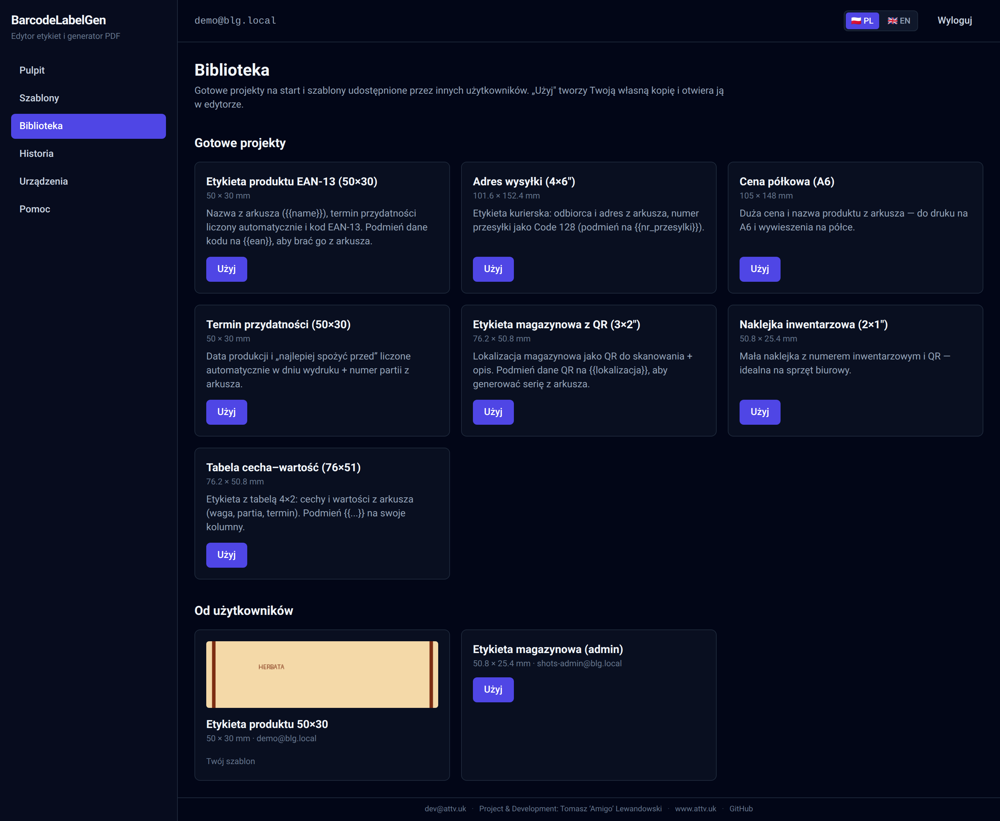

Przycisk **„Użyj"** zawsze tworzy **Twoją własną kopię** i od razu otwiera ją w edytorze — nie da się przypadkiem zepsuć oryginału.

### Udostępnianie własnego szablonu

Chcesz, żeby inni w firmie mogli skorzystać z Twojego szablonu? Udostępnij go w Bibliotece:

1. Na stronie **Szablony** najedź myszką na kafelek szablonu i kliknij **⚙**.
2. Zaznacz **„Udostępnij w Bibliotece"**.
3. Opcjonalnie wgraj **grafikę wyróżniającą** — to obrazek podglądowy, który będzie widoczny na kafelku listy i w Bibliotece.


Od tej chwili wszyscy zalogowani użytkownicy widzą szablon w Bibliotece i mogą go sklonować — ale **edytować oryginał możesz tylko Ty**. Udostępniony szablon ma na liście ikonę 📚. Odznacz pole, aby wycofać go z Biblioteki.

---

## 3. Tworzenie etykiety — przewodnik po obiektach

Wszystko poniżej znajdziesz w **lewym panelu**, w sekcji *Dodaj*. Każdy przycisk wstawia inny typ **obiektu** — czyli elementu, który możesz dowolnie przesuwać i edytować na etykiecie.

### T — Tekst

**Co robi:** Wstawia pojedynczą linię tekstu o stałym rozmiarze — nie zawija się, jeśli tekst jest za długi.
**Kiedy używać:** Nagłówki, krótkie napisy, stałe informacje.
**Jak:**

1. Kliknij **T Tekst** w lewym panelu.
2. Zaznacz nowy obiekt na canvasie.
3. W prawym panelu wpisz treść w polu tekstowym.

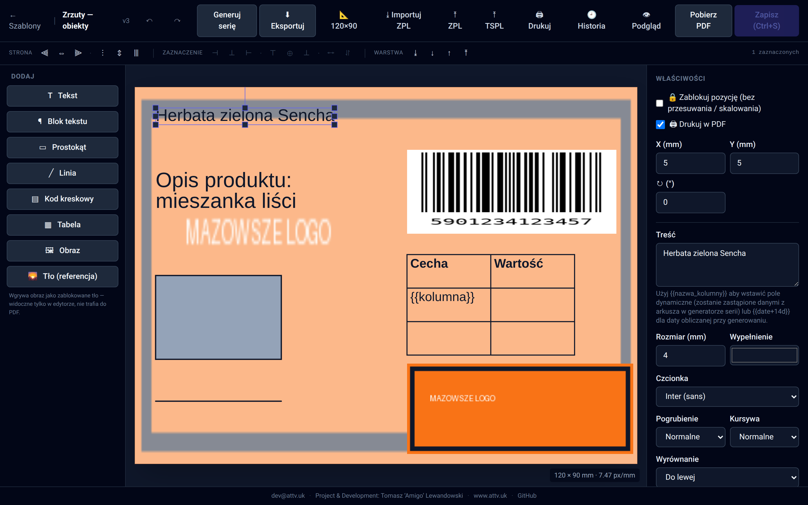

### ¶ — Blok tekstu

**Co robi:** Wstawia wieloliniowy tekst, który automatycznie zawija się w ramce. Możesz też włączyć **auto-skalowanie** — program sam zmniejszy lub zwiększy font, żeby tekst zmieścił się w ramce.
**Kiedy używać:** Opisy produktów o zmiennej długości — świetnie sprawdza się z `{{description}}` pobieranym z arkusza (patrz sekcja 6).
**Jak:**

1. Kliknij **¶ Blok tekstu**.
2. W prawym panelu zaznacz **Auto-skalowanie** i ustaw minimalny oraz maksymalny rozmiar fontu.

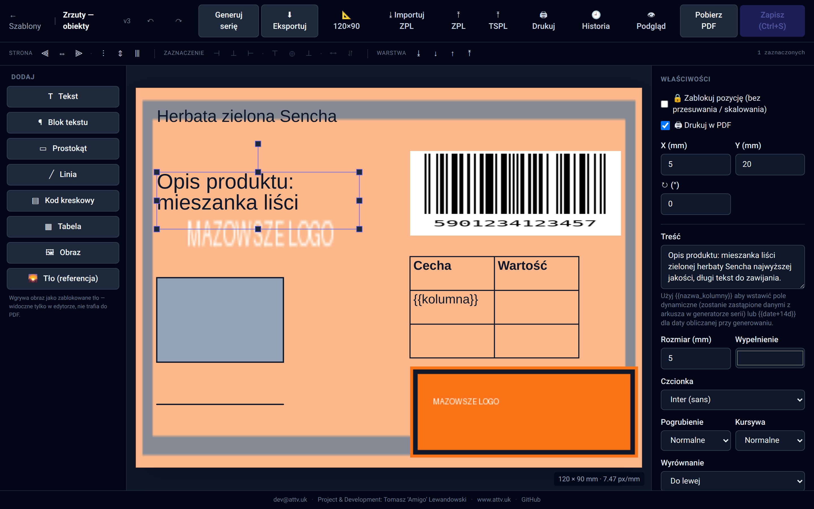

### ▭ — Prostokąt, ╱ — Linia

**Co robi:** Dodaje prostą geometrię — ramki, separatory, podziałki.
**Jak:**

1. Kliknij ▭ lub ╱.
2. Przeciągnij na canvasie, żeby ustawić rozmiar.
3. W prawym panelu ustaw kolor wypełnienia i obrysu.


### ▤ — Kod kreskowy

**Co robi:** Generuje **kod kreskowy** (czytelny dla skanera kod graficzny reprezentujący np. numer produktu) na podstawie podanej wartości.
**Kiedy używać:** Każdy katalog produktów, który ma swoje kody.
**Jak:**

1. Kliknij **▤ Kod kreskowy**.
2. W prawym panelu wybierz typ kodu (EAN-13, Code128 itd.).
3. Wpisz dane — możesz też wpisać `{{sku}}`, żeby wartość była pobierana automatycznie z arkusza (patrz sekcja 6).

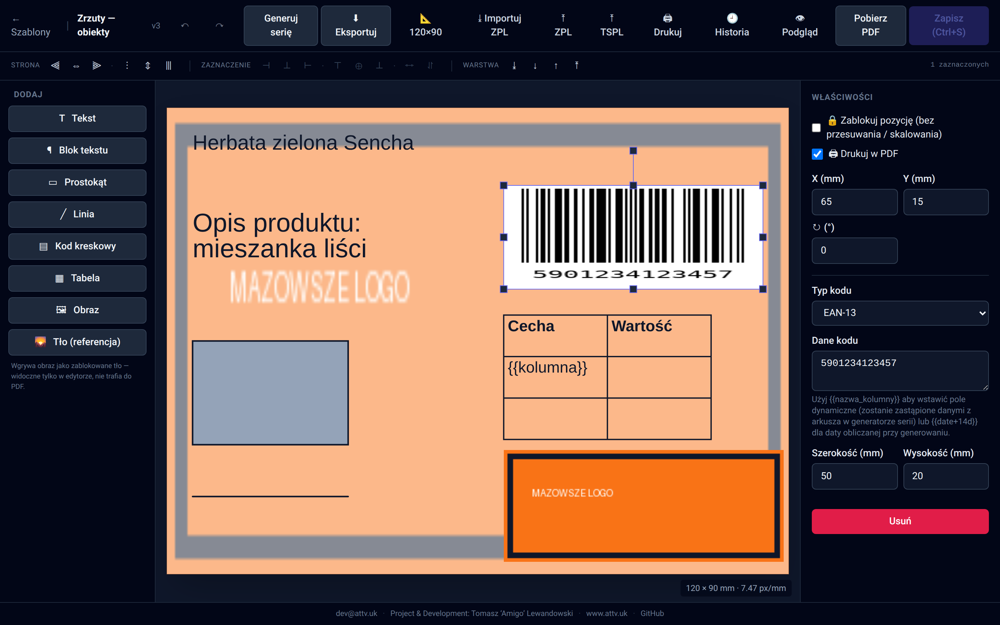

### ▦ — Tabela

**Co robi:** Wstawia siatkę wierszy i kolumn z tekstem w komórkach — przydatna do etykiet typu cecha–wartość, tabelek wartości odżywczych albo krótkiej listy pozycji.
**Jak:**

1. Kliknij **▦ Tabela**.
2. W prawym panelu ustaw liczbę wierszy i kolumn.
3. Wpisz treść komórek — możesz używać placeholderów `{{kolumna}}` i dat `{{date+x}}` (patrz sekcje 6 i 7); pod siatką pojawią się kolorowe chipy z podglądem.
4. Ustaw szerokości kolumn (w mm), font i ramkę.
5. Zaznacz **Pogrubiony nagłówek**, jeśli chcesz wyróżnić pierwszy wiersz.


**Warto wiedzieć o druku:** tabela drukuje się poprawnie zarówno w PDF, jak i przy eksporcie do ZPL (patrz sekcja 7a). Jedno ograniczenie: obrócona tabela nie jest wspierana w ZPL — przy eksporcie wraca do pozycji bez obrotu.

### 🖼 — Obraz

**Co robi:** Wgrywa plik graficzny (PNG, JPG lub SVG) i wstawia go na canvas. Drukuje się normalnie w PDF.
**Kiedy używać:** Logo firmy, ikony, zdjęcia produktu.
**Jak:**

1. Kliknij **🖼 Obraz**.
2. Wybierz plik z komputera (maksymalnie 5 MB).

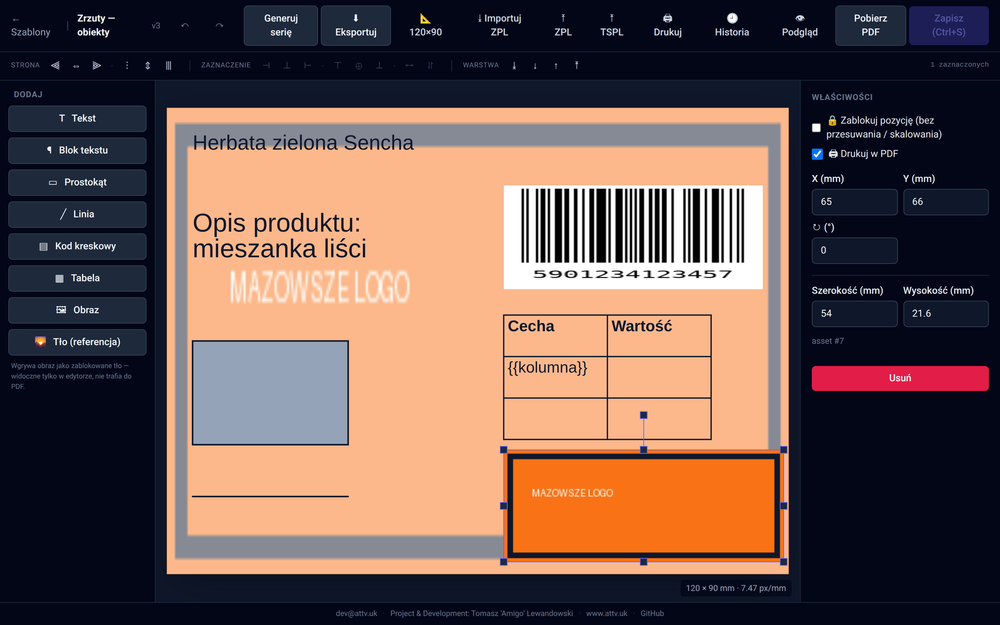

### 🌄 — Tło (referencja)

**Co robi:** Wgrywa obraz jako **zablokowane tło na cały rozmiar etykiety** — widoczne tylko w edytorze, jako pomoc wizualna. Tło **nie drukuje się** w PDF.
**Kiedy używać:** Twoje etykiety przyszły z drukarni z już wydrukowanym logo. Skanujesz taki wzór, wgrywasz go jako tło, ustawiasz nowy tekst dokładnie tam, gdzie powinien być, generujesz PDF — drukarka dodrukowuje tylko nowy tekst, a logo nie dubluje się na wydruku.
**Jak:**

1. Kliknij **🌄 Tło**.
2. Wybierz plik. Tło ląduje na samym dole stosu obiektów i jest zablokowane — nie ma uchwytów do przesuwania.
3. Żeby je zmienić: zaznacz je, potem w prawym panelu odznacz **Zablokuj pozycję** albo zaznacz **Drukuj w PDF**, jeśli jednak chcesz, żeby się wydrukowało.


---

## 4. Praca z obiektami

### Zaznaczanie

- Pojedynczy klik = zaznacz jeden obiekt.
- **Shift + klik** = dodaj kolejny obiekt do zaznaczenia (tzw. multi-select — zaznaczenie kilku naraz).
- **Ctrl/Cmd + A** = zaznacz wszystkie obiekty na etykiecie.


### Przesuwanie i skalowanie

- Przeciągaj zaznaczony obiekt myszką, żeby go przesunąć.
- Uchwyty na rogach służą do zmiany rozmiaru; uchwyt nad obiektem służy do obrotu.
- Obiekt **zablokowany** nie ma uchwytów — ale wciąż możesz go zaznaczyć i odblokować w prawym panelu.

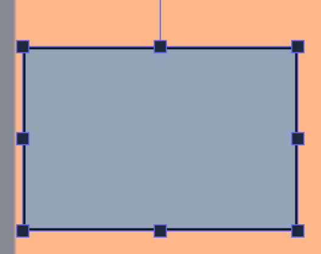

### Cofanie zmian

- **Ctrl/Cmd + Z** = cofnij ostatnią zmianę.
- **Ctrl/Cmd + Shift + Z** lub **Ctrl/Cmd + Y** = przywróć cofniętą zmianę.

Jedna operacja to jeden krok historii — np. wyrównanie 5 obiektów naraz cofniesz jednym Ctrl+Z.

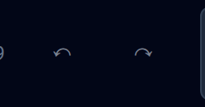

### Duplikowanie (robienie kopii)

Dwa szybkie sposoby na skopiowanie zaznaczonego obiektu (albo całego zaznaczenia wielu obiektów):

- **Alt + przeciąganie** — przytrzymaj **Alt** (na Mac: **Option**) i przeciągnij zaznaczony obiekt. Oryginał zostaje na miejscu, a kopia ląduje tam, gdzie puścisz myszkę.
- **Ctrl/Cmd + D** — tworzy kopię „w miejscu", przesuniętą o 5 mm w prawo i w dół. Zaznaczenie od razu przeskakuje na nową kopię, więc kolejne Ctrl+D buduje schodek kopii.

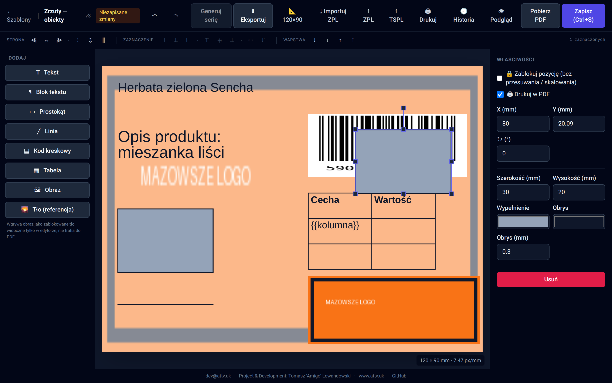

Kopia dziedziczy wszystko: font, kolor, obrót, ustawienia *Zablokuj* i *Drukuj w PDF*. Obrazy współdzielą ten sam plik źródłowy, więc nie zajmują dodatkowego miejsca.

### Kolejność warstw (co jest na wierzchu)

W **pasku wyrównania**, w grupie **Warstwa**:

- ⤓ **Na sam dół** — chowa zaznaczony obiekt pod resztę.
- ↓ **Niżej** — przesuwa o jedną pozycję w dół.
- ↑ **Wyżej** — przesuwa o jedną pozycję w górę.
- ⤒ **Na sam wierzch** — stawia obiekt nad wszystkimi innymi.

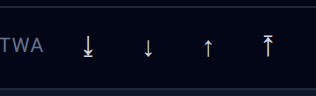

### Blokada i drukowanie (prawy panel)

Na samej górze prawego panelu każdy obiekt ma dwa pola wyboru:

- **🔒 Zablokuj pozycję** — wyłącza przesuwanie i zmianę rozmiaru (nadal można edytować font, kolor itd.).
- **🖨 Drukuj w PDF** — domyślnie zaznaczone. Jeśli je odznaczysz, obiekt będzie widoczny tylko w edytorze i nie pojawi się w wygenerowanym PDF. Takie obiekty są wyblakłe na canvasie, żebyś od razu widziała/widział, że nie wydrukują się.

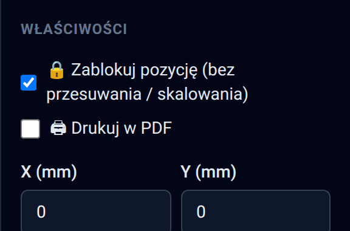

### Autozapis

Edytor sam zapisuje Twoją pracę co kilka sekund. Status widzisz w pasku narzędzi:

- **Niezapisane zmiany** — jest coś do zapisania.
- **Autozapis…** — trwa wysyłanie.
- **Autozapisano 12:34** — ostatni udany zapis.

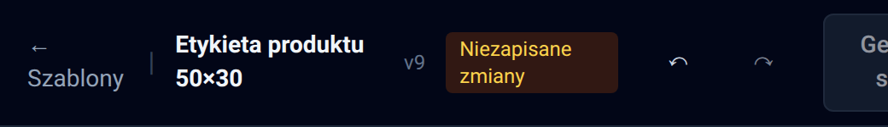

Możesz też w każdej chwili kliknąć **Zapisz** ręcznie.

### Historia wersji

Każdy **ręczny** zapis (przycisk **Zapisz** albo **Ctrl+S**) tworzy nową **wersję** szablonu — czyli migawkę tego, jak wyglądał w danym momencie. Autozapis nadpisuje bieżący stan i nie tworzy dodatkowych wersji, dzięki czemu lista pozostaje krótka i czytelna.

1. Kliknij **🕘 Historia** w pasku narzędzi.
2. Zobaczysz listę wersji: numer, datę i autora.
3. Kliknij **Przywróć** przy tej, do której chcesz wrócić.

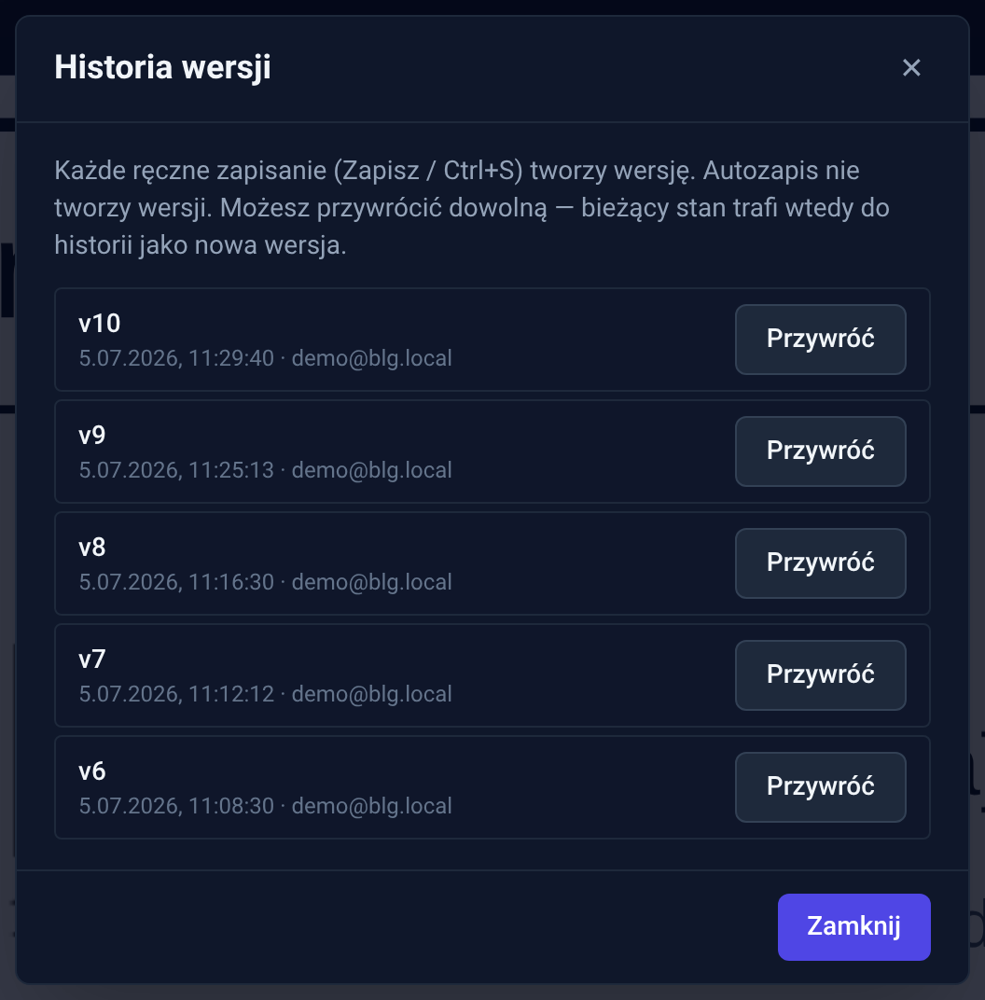

Przywrócenie zapisuje bieżący stan jako nową wersję, więc niczego nie tracisz bezpowrotnie — program trzyma 30 ostatnich wersji na szablon.

### Zmiana rozmiaru etykiety

Rozmiar wybrany przy tworzeniu szablonu **można zmienić w każdej chwili**.

1. W pasku narzędzi kliknij przycisk **📐 {szerokość}×{wysokość}**.
2. Wpisz nową szerokość i wysokość w mm (od 1 do 1000) albo kliknij jeden z gotowych presetów (40×100, 50×30, 100×150, 105×148, 210×297).
3. Kliknij **Zastosuj**.


*kadr: modal z polami Szerokość/Wysokość i rzędem presetów-chipów; kursor nad przyciskiem „Zastosuj".*

Obiekty **nie są przeskalowywane** — zachowują swoje pozycje w milimetrach. Jeśli zmniejszysz etykietę, po prostu przeciągnij z powrotem elementy, które wystają poza nową krawędź.

---

## 5. Pobieranie PDF — pojedyncza etykieta

Chcesz najpierw zobaczyć wynik? Kliknij **👁 Podgląd** — PDF pojawi się w oknie aplikacji razem z przyciskiem **Pobierz PDF**.

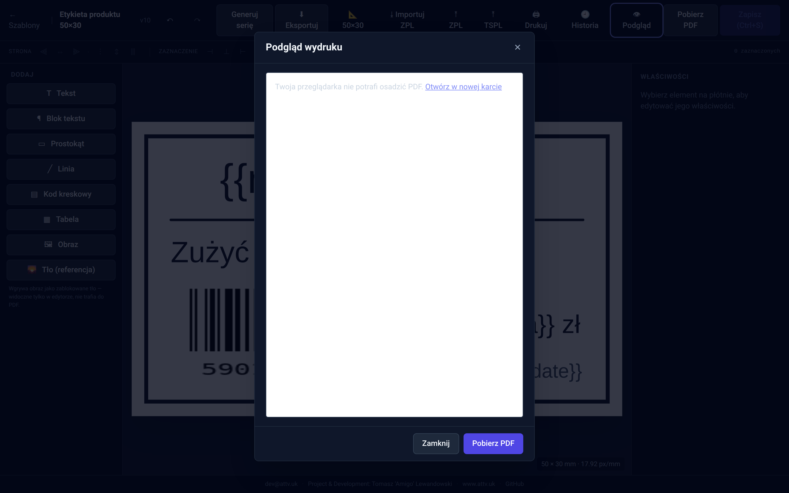

Możesz też od razu kliknąć **Pobierz PDF** w pasku narzędzi — plik zacznie się ściągać po kilku sekundach.

Jeśli jakiś tekst nie zmieścił się w swoim bloku, zobaczysz w pasku narzędzi chip **„N ostrzeżeń"**. Najedź na niego myszką, żeby zobaczyć szczegóły.

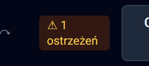

Uwaga: placeholdery kolumn (`{{name}}` — miejsce, w które program sam wstawi dane z arkusza) w pojedynczym PDF zostają jako zwykły tekst — prawdziwe dane podstawia dopiero **generowanie serii** (sekcja 6). Placeholdery daty (`{{date+14d}}`, sekcja 7) są natomiast obliczane od razu, także tutaj.

---

## 6. Generowanie serii — wiele etykiet z jednego szablonu

To jest **główna funkcja programu**. Pozwala wygenerować np. 200 etykiet z jednego szablonu, gdzie każda dostaje inne dane — np. inną nazwę produktu i inny kod kreskowy — pobrane z arkusza albo z bazy danych.

### Krok 0 — przygotuj szablon

W obiekcie Tekst albo Kod kreskowy wstaw **placeholder** — czyli miejsce, w które program sam wstawi dane z Twojego arkusza — w postaci `{{nazwa_kolumny}}`, np.:

- Tekst: `{{name}}`
- Dane kodu kreskowego: `{{sku}}`

Każde takie wystąpienie zostanie podmienione wartością z odpowiedniej kolumny.


*kadr: prawy panel Właściwości z polem tekstowym zawierającym `{{name}}` i `{{date+14d}}`; poniżej dwa chipy — fioletowy `{{name}}` i zielony `{{date+14d}} → 18.07.2026`.*

### Krok 1 — wgraj dane

1. W pasku narzędzi kliknij **Generuj serię**.
2. W Kroku 1 wybierz plik z danymi.

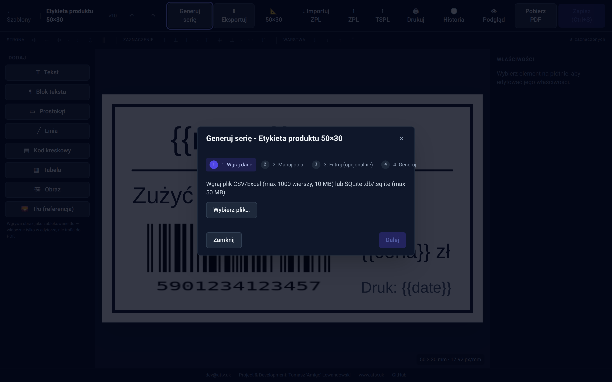

Akceptowane formaty:

| Format | Maksymalny rozmiar pliku | Maksymalna liczba wierszy |
|---|---|---|
| `.csv` | 10 MB | 1000 |
| `.xls` / `.xlsx` | 10 MB | 1000 |
| `.db` / `.sqlite` / `.sqlite3` | 50 MB | 1000 (na zapytanie) |

#### Jeśli wgrywasz CSV lub Excel

Plik trafia na serwer i od razu jest odczytywany. Zobaczysz listę wykrytych kolumn i liczbę wierszy.

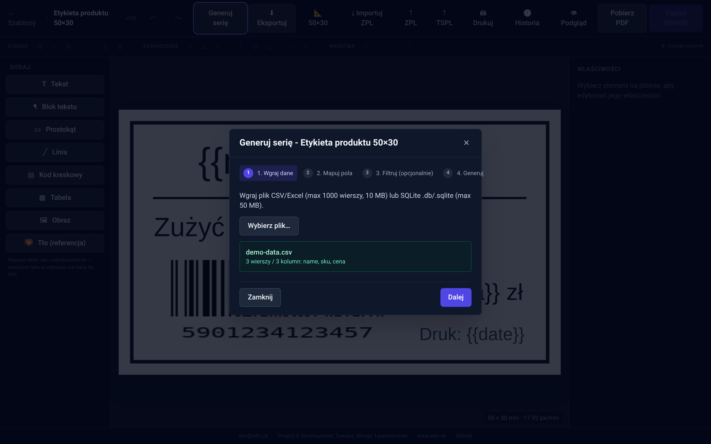

Kliknij **Dalej**.

#### Jeśli wgrywasz SQLite (bazę danych)

**SQLite** to plik z bazą danych — jeśli ktoś w firmie eksportuje dane z systemu magazynowego do takiego pliku, możesz go użyć bezpośrednio, bez konwersji na CSV.

1. Po wgraniu pliku program pokaże **listę tabel** w bazie, posortowaną tak, że tabele z największą liczbą wierszy są na górze.
2. Wybierz tabelę, która zawiera dane, których potrzebujesz.
3. Kliknij **Użyj tego źródła**.

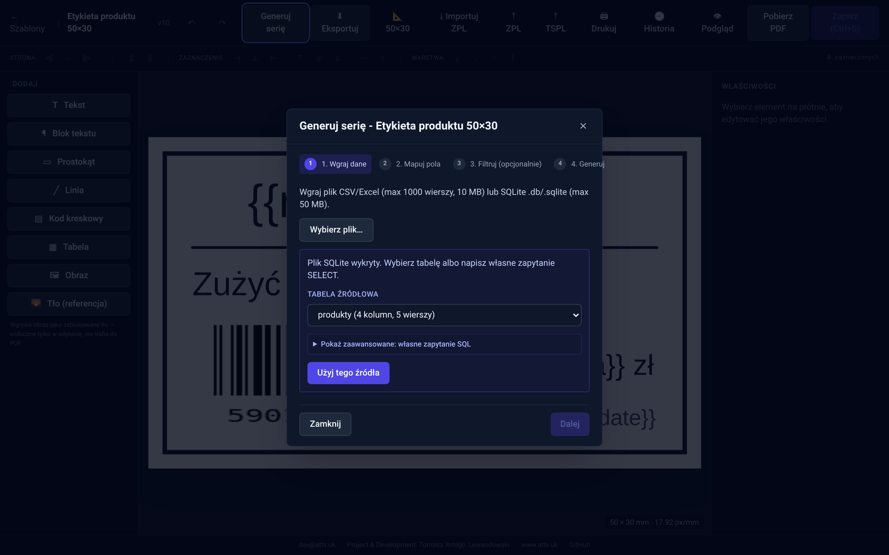

Jeśli potrzebujesz węższego wyboru danych (np. tylko produkty z jednej kategorii), rozwiń **Pokaż zaawansowane** i wpisz zapytanie SELECT — to polecenie języka baz danych, które mówi programowi dokładnie, jakie dane pobrać, np.:

```sql
SELECT sku, name, price
FROM products
WHERE category = 'labels' AND price > 0
```

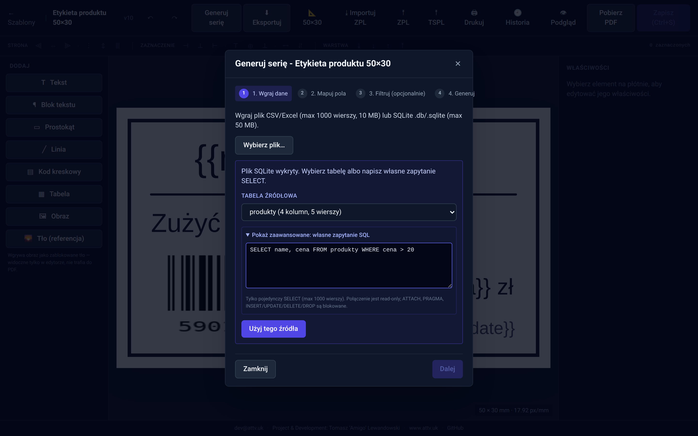

**Bezpieczeństwo danych:** połączenie z bazą jest tylko do odczytu. Program przyjmuje wyłącznie polecenia odczytujące dane (SELECT) — żadne polecenie mogące coś zmienić lub skasować nie zostanie wykonane. Wynik może mieć maksymalnie 1000 wierszy.

### Krok 2 — dopasuj pola (mapowanie)

Program sam wykrywa wszystkie placeholdery `{{...}}` z Twojego szablonu. Jeśli nazwa placeholdera pasuje dokładnie do nazwy kolumny w danych, dopasowanie ustawia się samo. Jeśli nazwy się różnią, wybierz kolumnę ręcznie z listy.


*kadr: krok 2 kreatora z listą placeholderów po lewej i selectami kolumn po prawej; przy `{{date}}` widoczna zielona podpowiedź „Opcjonalne — bez mapowania użyta zostanie dzisiejsza data".*

### Krok 3 — filtr (opcjonalnie)

Jeśli nie chcesz drukować wszystkich wierszy z arkusza, możesz je odsiać, np. tylko produkty droższe niż 10 zł albo takie, których nazwa zawiera słowo „herbata".

1. Wybierz kolumnę, warunek (np. „większe niż") i wartość.
2. Kliknij **Sprawdź filtr**, żeby zobaczyć, ile wierszy się załapie.

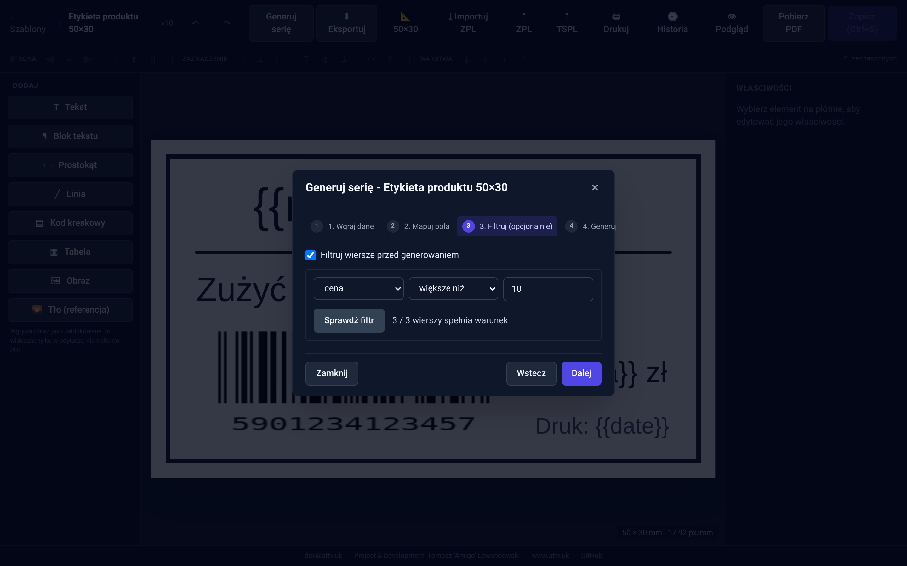

Możesz też pominąć ten krok, jeśli chcesz wygenerować etykiety dla wszystkich wierszy.

### Krok 4 — wygeneruj PDF

Kliknij **Generuj PDF**. Program zaczyna pracować w tle, a pasek postępu pokazuje, ile zostało. Po zakończeniu PDF zaczyna się pobierać automatycznie.

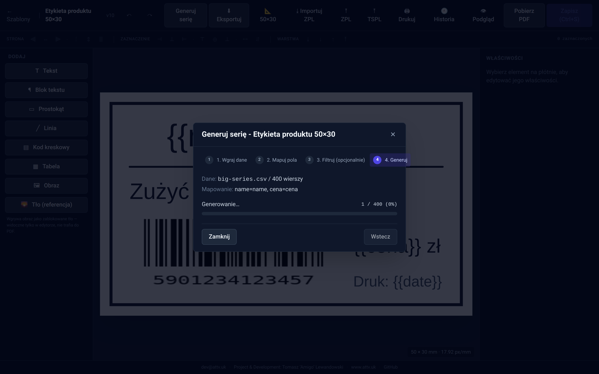

Jeśli w niektórych etykietach tekst nie zmieścił się w swoim bloku, zobaczysz listę ostrzeżeń — które wiersze, które obiekty. PDF i tak zostanie wygenerowany dla wszystkich etykiet.

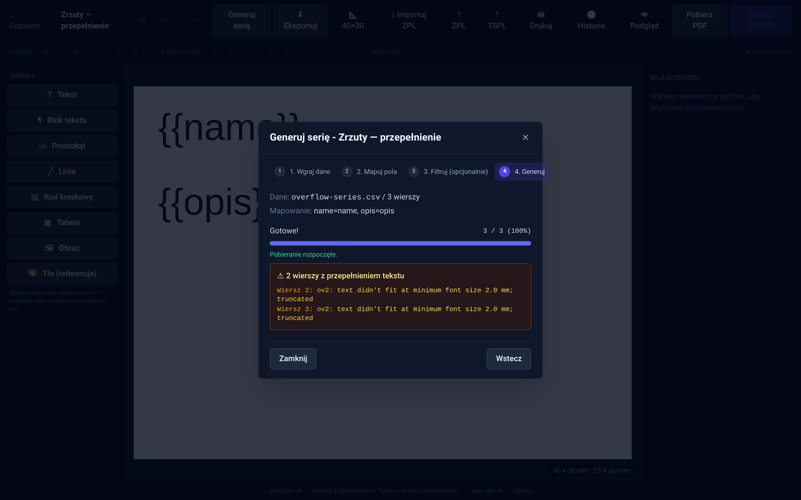

---

## 7. Placeholdery daty — `{{date+…}}`

Oprócz kolumn z arkusza możesz wstawić **daty liczone automatycznie w momencie generowania etykiety** — idealne do terminów przydatności („zużyć do") i dat produkcji. Działają wszędzie: w pojedynczym PDF, w serii i w eksporcie ZPL.

### Jak to zapisać

| Wpisujesz | Dostajesz (przy generowaniu 04.07.2026) |
|---|---|
| `{{date}}` | 04.07.2026 (dzisiejsza data) |
| `{{date+14d}}` | 18.07.2026 (+14 dni) |
| `{{date-7d}}` | 27.06.2026 (−7 dni) |
| `{{date+3m}}` | 04.10.2026 (+3 miesiące) |
| `{{date+1y}}` | 04.07.2027 (+1 rok) |
| `{{date+14d:DD/MM/YY}}` | 18/07/26 (własny format) |
| `{{date+3m:YYYY-MM-DD}}` | 2026-10-04 |

- Jednostki przesunięcia: **d** = dni, **m** = miesiące, **y** = lata. Działa zarówno `+`, jak i `-`.
- Format zapisu daty (opcjonalny, po dwukropku) budujesz z klocków **DD**, **MM**, **YY**, **YYYY** — separatory (kropki, ukośniki, myślniki, spacje) zostają bez zmian. Bez podania formatu dostajesz `DD.MM.YYYY`.
- Koniec miesiąca jest bezpieczny: 31 stycznia + 1 miesiąc da 28 lub 29 lutego — program nigdy nie stworzy nieistniejącej daty typu „31 lutego".

### Skąd wiesz, że to zadziała

Po wpisaniu placeholdera w prawym panelu pojawia się **zielony chip z podglądem obliczonej daty** (fioletowe chipy to zwykłe kolumny z arkusza). Najedź na chip myszką — podpowiedź przypomni, że ostateczna wartość liczy się dopiero w momencie generowania.


*kadr: zbliżenie na prawy panel; pole Treść z `{{date+14d}}` i zielony chip `{{date+14d}} → 18.07.2026` pod spodem.*

### Dobrze wiedzieć

- Jeśli w arkuszu masz **kolumnę o nazwie `date`**, to ona ma pierwszeństwo dla gołego `{{date}}`. Formy z przesunięciem (`{{date+14d}}`) zawsze liczą się automatycznie, niezależnie od kolumn w arkuszu.
- Data liczy się **w momencie generowania** PDF lub ZPL, według zegara serwera — nie w momencie, gdy zapisujesz szablon.
- W kreatorze serii pola datowe **nie wymagają mapowania** na żadną kolumnę.

---

## 7a. Drukowanie na drukarkach etykiet (ZPL i TSPL)

Etykiety drukowane na specjalnych drukarkach etykiet (np. Zebra, TSC, Toshiba) nie używają zwykłego PDF-a — mówią własnym językiem poleceń. Program potrafi ten język zarówno **czytać** (import), jak i **pisać** (eksport), więc nie musisz znać się na nim samodzielnie.

### ZPL — drukarki Zebra i zgodne

**ZPL** to specjalny język, którym rozmawiają drukarki etykiet marki Zebra (i modele zgodne z nią). Program potrafi zaimportować istniejącą etykietę zapisaną w ZPL do edytora oraz wyeksportować Twój projekt jako kod ZPL.

#### Import ZPL

1. W pasku narzędzi kliknij **⤓ Importuj ZPL**.
2. Wklej kod ZPL — np. otrzymany od dostawcy etykiet albo z innego systemu.
3. Wybierz **DPI drukarki** — to gęstość wydruku, czyli liczba kropek na milimetr, jaką drukuje drukarka. Jeśli nie wiesz, jakie DPI ma Twoja drukarka, zostaw **Wykryj automatycznie** — program porówna wymiary z kodu z rozmiarem Twojej etykiety i sam je odgadnie.
4. Kliknij **Sprawdź** — zobaczysz liczbę rozpoznanych obiektów i wykryte DPI. Jeśli etykieta z kodu jest większa niż Twoja, dostaniesz podpowiedź.
5. Kliknij **Importuj** — obiekty lądują na canvasie.


*kadr: modal z wklejonym kodem ZPL, selektem DPI ustawionym na „Wykryj automatycznie" i wynikiem analizy „12 obiektów · 203 dpi".*

**Uwaga:** import zastępuje obecną zawartość etykiety — jeśli coś już zaprojektowałaś/eś, zrób najpierw kopię (sekcja 8a).

#### Eksport ZPL

W pasku narzędzi kliknij **⤒ ZPL**. Do wyboru masz dwa tryby:

- **Szablon (zmienne)** — jeden kod ZPL z Twojego projektu. Placeholdery kolumn `{{...}}` zostają w kodzie jako tekst (podmienisz je we własnym systemie), a placeholdery daty są od razu obliczone. Do dyspozycji masz przyciski **Kopiuj** i **Pobierz .zpl**.
- **Wsad (dataset)** — wybierz wcześniej wgrany plik danych, a program wygeneruje jeden plik `.zpl` z osobną etykietą dla każdego wiersza (podmienione i kolumny, i daty).


*kadr: modal w trybie „Szablon (zmienne)" z podglądem wygenerowanego kodu i przyciskami Kopiuj / Pobierz .zpl.*

Wybierz DPI zgodne z Twoją drukarką (zwykle 203 lub 300).

### TSPL — drukarki TSC i Toshiba

**TSPL** to odpowiednik ZPL dla drukarek marki TSC i Toshiba — inny dialekt tego samego pomysłu: język poleceń zrozumiały dla drukarki etykiet.

1. W pasku narzędzi kliknij **⤒ TSPL**.
2. Wybierz DPI drukarki (203 lub 300).
3. Zobaczysz na bieżąco podgląd wygenerowanego kodu.
4. Kliknij **Kopiuj** albo **Pobierz .txt**.

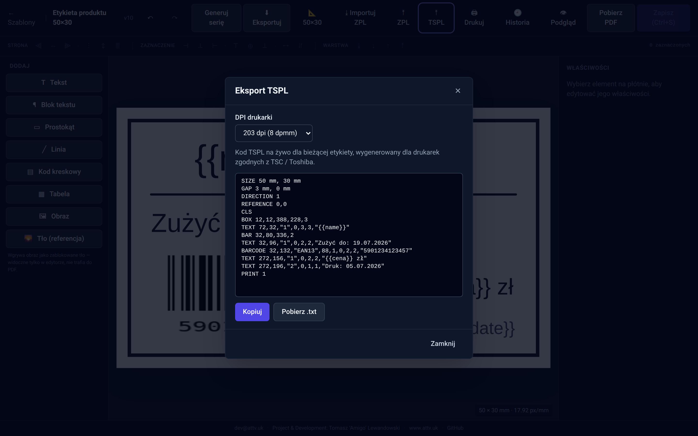

Eksport TSPL działa tylko dla pojedynczej etykiety (bez trybu Wsad) i nie ma jeszcze importu w drugą stronę — to funkcja na wcześniejszym etapie rozwoju niż ZPL.

### Najprościej: kreator „Podłącz drukarkę"

Nie chcesz ręcznie tworzyć pliku ustawień ani przeklejać kodów? Aplikacja ma **kreator**, który przeprowadzi Cię przez wszystko krok po kroku — sam pobierze właściwy program, przygotuje gotowy plik ustawień i poda jedną komendę do skopiowania. Wejdź w **Urządzenia** i kliknij **🖨 Podłącz drukarkę**.

1. **Wybierz swój komputer.** Kreator sam wykrywa system (Mac / Windows / Linux) — potwierdź jednym kliknięciem.

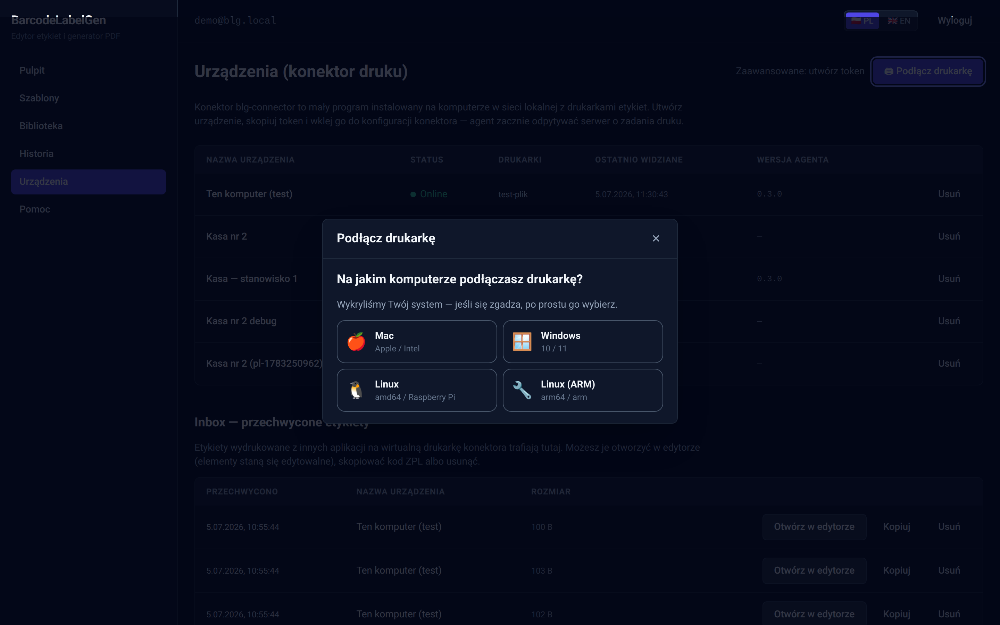

2. **Nazwij ten komputer** (np. „Komputer w biurze") — to tylko etykieta, żebyś rozpoznał go na liście.

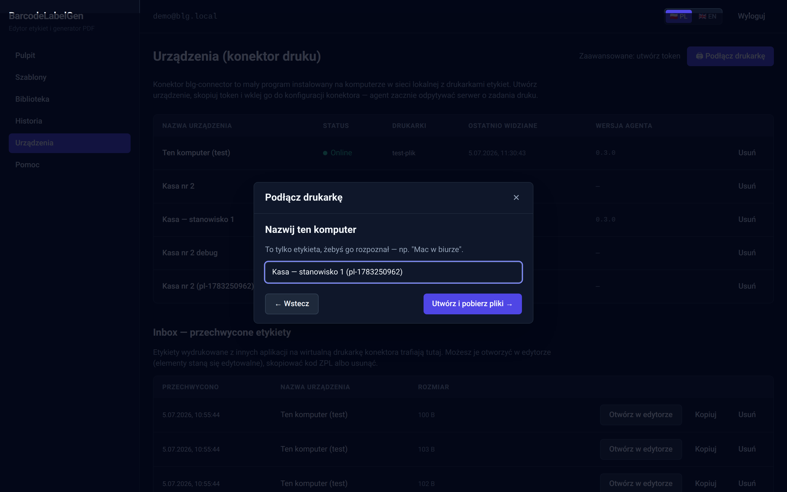

3. **Pobierz dwa pliki** — program łączący oraz gotowy plik ustawień (adres serwera i Twój kod są już w nim wpisane; nic nie trzeba edytować).

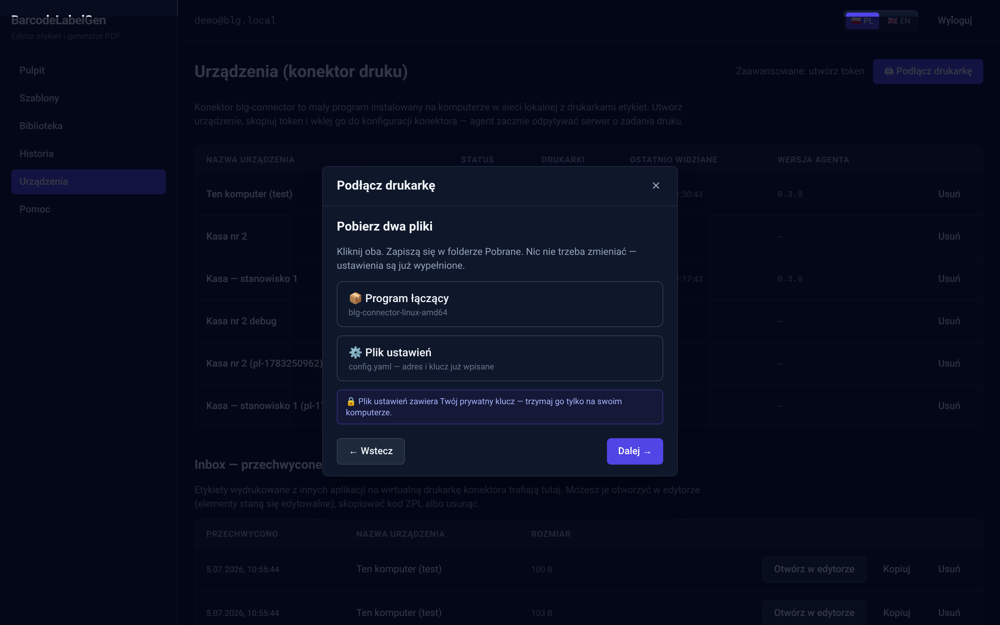

4. **Uruchom program** — skopiuj jedną gotową komendę i wklej ją w Terminalu (na Macu kreator chowa w niej zdjęcie systemowej blokady). Zostaw to okno otwarte.

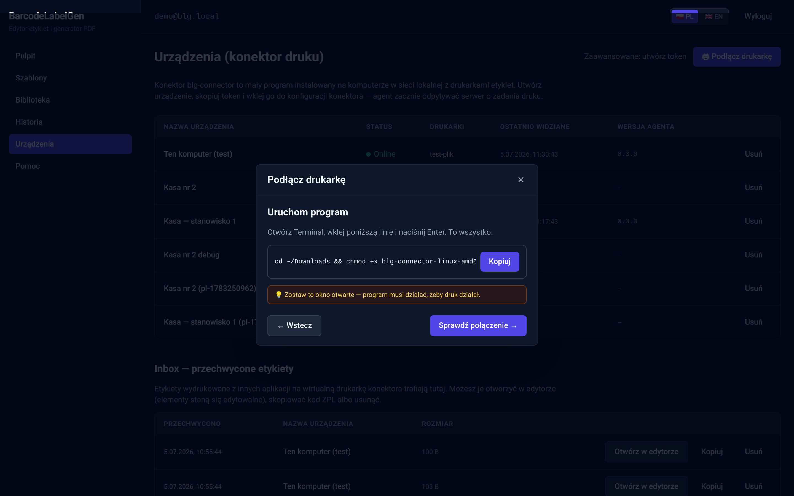

5. **Poczekaj na połączenie** — kreator sam wykryje, gdy komputer się zgłosi, i pokaże „Połączono".

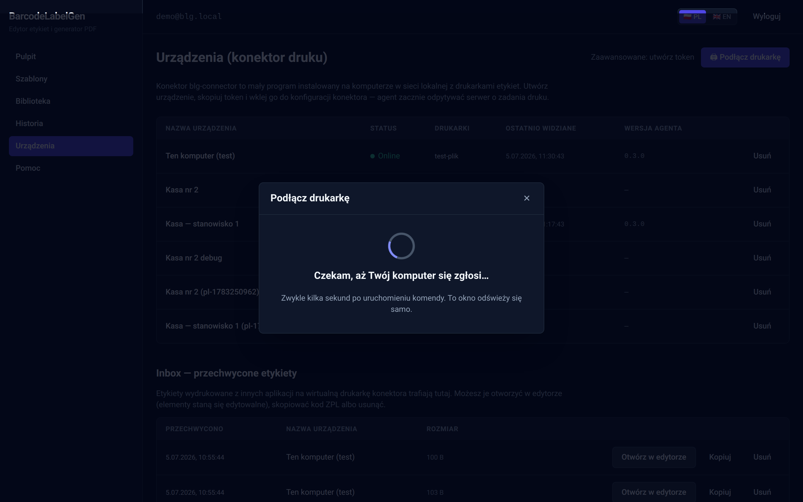

6. **Wskaż drukarkę (opcjonalnie)** — podaj adres IP drukarki albo zostaw tryb testowy (wydruki zapisywane do pliku), żeby najpierw wszystko sprawdzić.

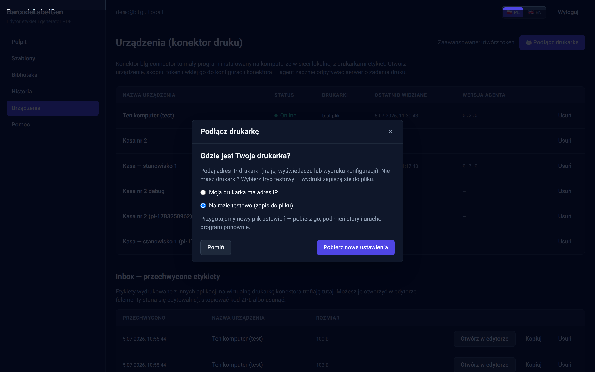

Gdy komputer pokaże się jako **Online**, drukujesz z edytora dokładnie tak, jak opisano niżej.

### Sposób zaawansowany: ręczna konfiguracja konektora

Jeśli wolisz zrobić to ręcznie (albo automatyzujesz wiele stanowisk), możesz drukować **prosto z edytora** (dotyczy ZPL — nie TSPL) dzięki **konektorowi** — małemu programowi instalowanemu na komputerze w tej samej sieci co drukarki, który łączy aplikację z drukarką.

1. Zainstaluj agenta **blg-connector** na komputerze podłączonym do sieci z drukarkami (plik do pobrania w sekcji Assets każdego wydania na GitHubie; instrukcja konfiguracji: `connector/README.md`).
2. W aplikacji przejdź do **Urządzenia → Dodaj urządzenie**.

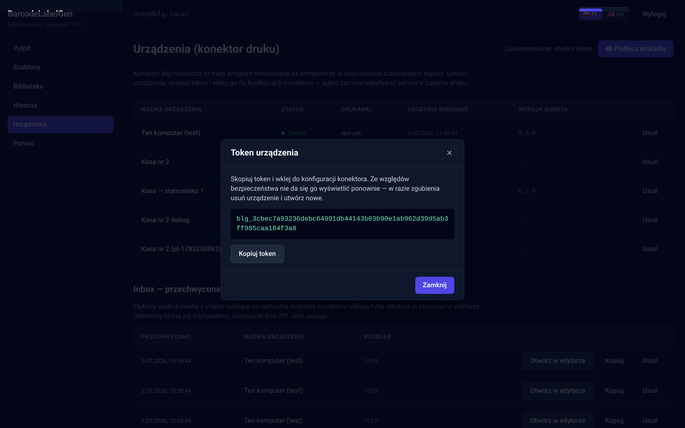

3. Skopiuj wygenerowany **token** (unikalny kod dostępu) do pliku `config.yaml` agenta. Urządzenie przejdzie w stan **Online** i zgłosi listę podłączonych drukarek.
4. W edytorze kliknij **🖨 Drukuj**, wybierz urządzenie, drukarkę, liczbę kopii i DPI, a potem kliknij **Drukuj**.

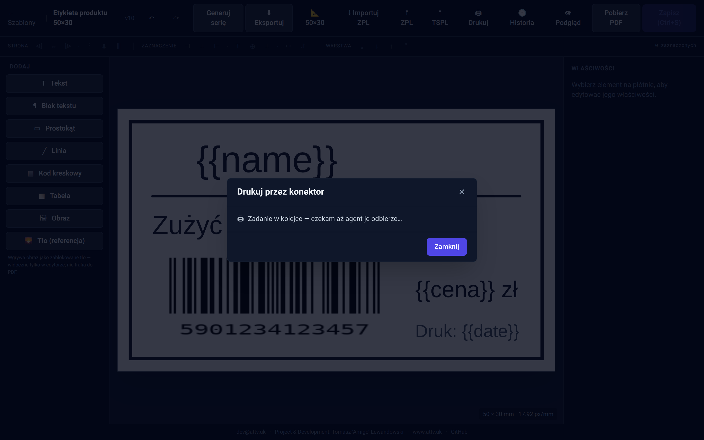

Okno pokaże na żywo postęp: *w kolejce → agent odebrał → wydrukowano* (albo błąd wraz z powodem).

**Szybka ścieżka:** jeśli konektor działa **na tym samym komputerze**, na którym masz otwartą przeglądarkę, program wykryje go automatycznie i zaproponuje opcję **⚡ Ten komputer — druk natychmiastowy**. Etykieta idzie wtedy prosto na drukarkę, bez rundy przez serwer.

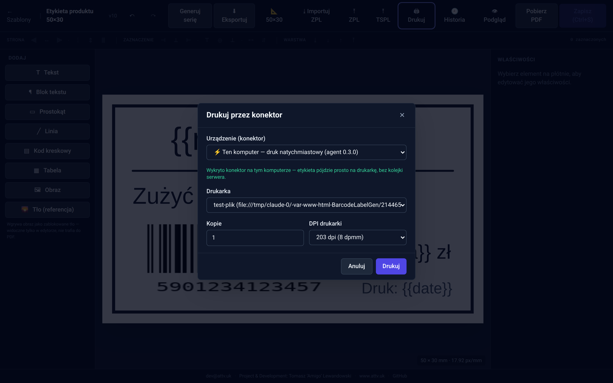

Placeholdery daty są obliczane w momencie druku; placeholdery kolumn zostają w kodzie (bo to druk pojedynczej etykiety, nie serii).

### Wirtualna drukarka — przejmij etykiety z innych programów

Konektor potrafi działać też **w drugą stronę**: udaje zwykłą drukarkę sieciową, a wszystko, co inne aplikacje (system magazynowy, Word, stary program) na nią wydrukują, trafia do **Inboxa** (skrzynki odbiorczej) na stronie **Urządzenia**.

1. W pliku `config.yaml` agenta włącz sekcję `capture` (instrukcja krok po kroku razem z konfiguracją drukarki w Windows znajduje się w `connector/README.md`).
2. Wydrukuj coś z dowolnej aplikacji na tę wirtualną drukarkę.
3. Przejdź do **Urządzenia → Inbox** i kliknij **Otwórz w edytorze** — etykieta staje się zwykłym szablonem: rozmiar wykryty z kodu, teksty i kody kreskowe od razu edytowalne.

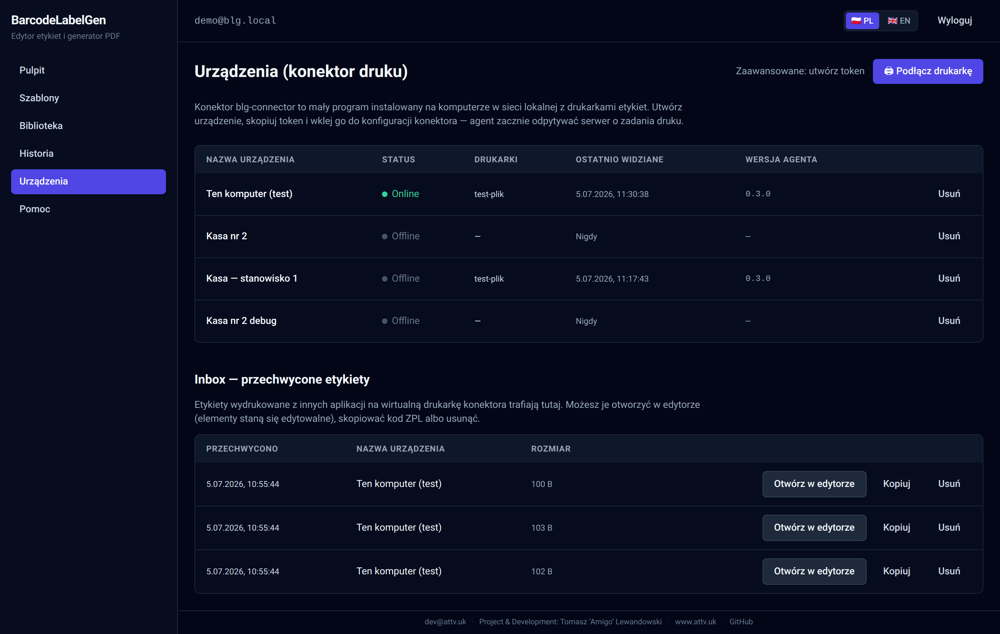

Z Inboxa możesz też skopiować surowy kod ZPL albo usunąć wpis. Program przechowuje maksymalnie 200 ostatnich przechwyceń na urządzenie.

---

## 7c. Historia wygenerowanych plików

W menu kliknij **Historia**. Każde wygenerowanie — pojedyncza etykieta (**Pobierz PDF**) i cała seria (PDF albo wsadowy ZPL) — trafia na listę: nazwa szablonu, typ, liczba etykiet, rozmiar, data.

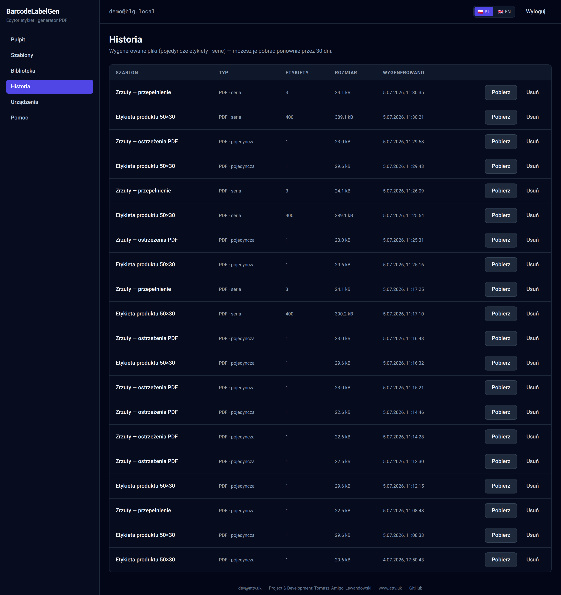

Kliknij **Pobierz**, aby pobrać plik ponownie bez generowania go od nowa, albo **Usuń**, aby skasować wpis. Pliki są dostępne przez **30 dni**, potem są automatycznie usuwane.

---

## 8. Administracja (tylko administrator)

Lewe menu → **Administracja → Użytkownicy**.


*kadr: tabela użytkowników z kolumnami Email / Rola / Aktywne / Ostatnie logowanie i przyciskiem „Utwórz konto" u góry.*

### Tworzenie użytkownika

1. Kliknij **Utwórz konto**.
2. Wpisz email i hasło tymczasowe (minimum 10 znaków; możesz też wygenerować losowe).
3. Wybierz rolę:
   - **Administrator** — pełny dostęp, w tym zarządzanie użytkownikami.
   - **Edytor** — tworzy i edytuje własne szablony oraz zestawy danych.
   - **Tylko podgląd** — może otwierać i oglądać, ale nie zapisuje zmian.

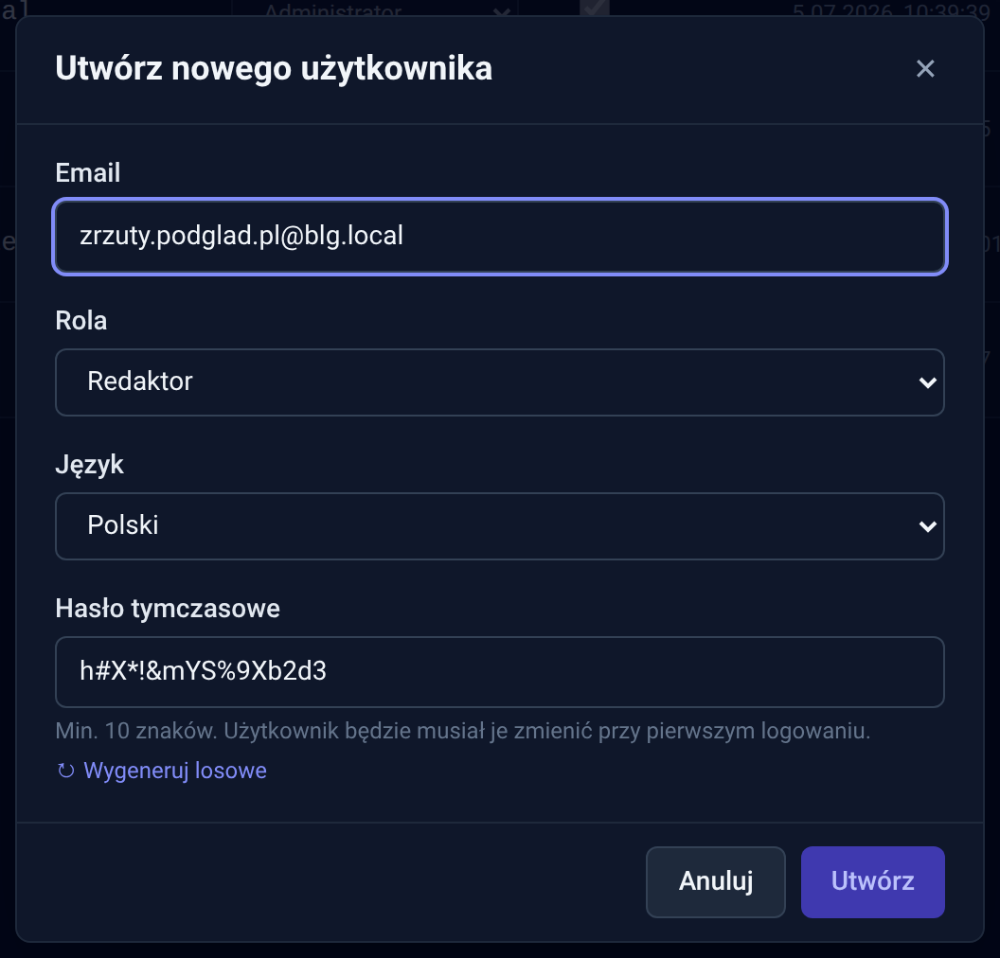

4. Po kliknięciu **Utwórz** program pokaże hasło tymczasowe **tylko raz** — od razu przekaż je nowemu użytkownikowi.

### Reset hasła

1. Przy koncie użytkownika kliknij **Resetuj hasło**.
2. Program wygeneruje nowe hasło tymczasowe — przekaż je użytkownikowi.

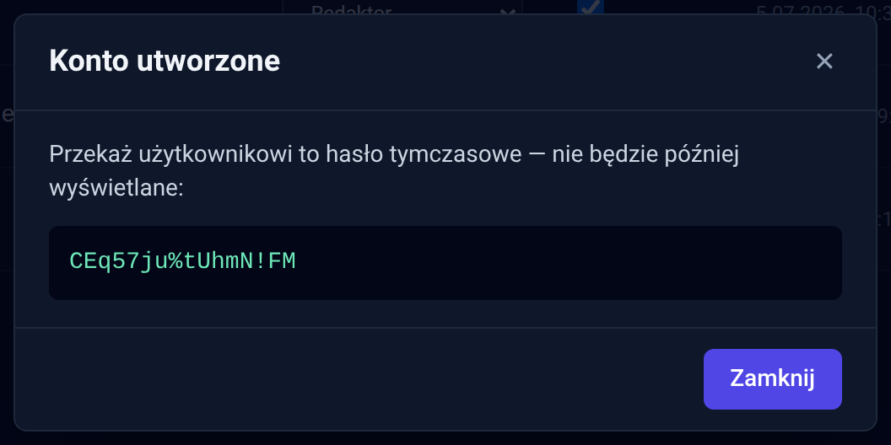

Przy następnym logowaniu użytkownik zostanie poproszony o ustawienie własnego hasła.

### Aktywacja / dezaktywacja konta

Przełącznik **Aktywne** w wierszu użytkownika włącza lub wyłącza dostęp do konta. Nie możesz dezaktywować własnego konta — to zabezpieczenie przed przypadkowym zablokowaniem samej/samego siebie.

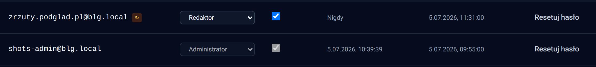

---

## 8a. Import / eksport szablonów

Każdy szablon możesz zapisać jako jeden plik `.blg-template.json` — zawiera rozmiar etykiety, pozycje wszystkich obiektów, ich treść oraz obrazki zakodowane wprost w pliku. Taki plik jest przenośny: możesz go zarchiwizować, wysłać mailem albo zaimportować na innej instalacji BarcodeLabelGen.

### Eksport

Masz dwie możliwości:

- Na stronie **Szablony**: najedź myszką na kafelek szablonu i kliknij ikonę **⬇** w prawym dolnym rogu.
- W edytorze: w pasku narzędzi kliknij **⬇ Eksportuj** (obok *Pobierz PDF*).

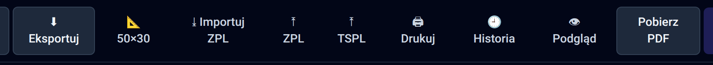

Pobierze się plik `<nazwa>.blg-template.json` — najlepiej trzymaj go w folderze z backupami.

### Import

Na stronie **Szablony** kliknij **⬆ Importuj** — otworzy się okno w dwóch krokach:

1. **Wybór pliku** — wskaż plik `.blg-template.json`. Program sprawdzi jego poprawność i pokaże podgląd.

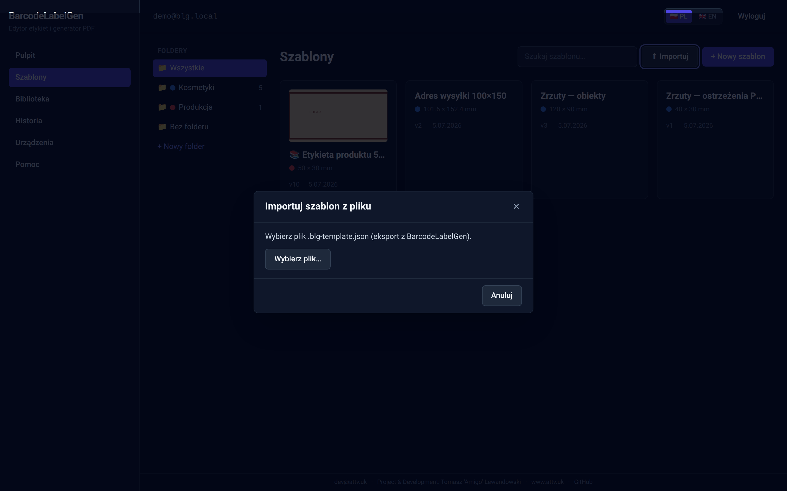

2. **Konfiguracja** — możesz tu:
   - zmienić nazwę nowego szablonu (domyślnie ta z pliku; przy powtórzeniu nazwy program doda dopisek „(kopia)"),
   - nadpisać rozmiar etykiety (puste pole = zostaw oryginalny),
   - odznaczyć obiekty, których nie chcesz importować (lista z ikoną typu i podglądem treści przy każdym),
   - dla każdego powtarzającego się obrazka wybrać: **Użyj istniejącego** (oszczędza miejsce) albo **Utwórz nową kopię**.

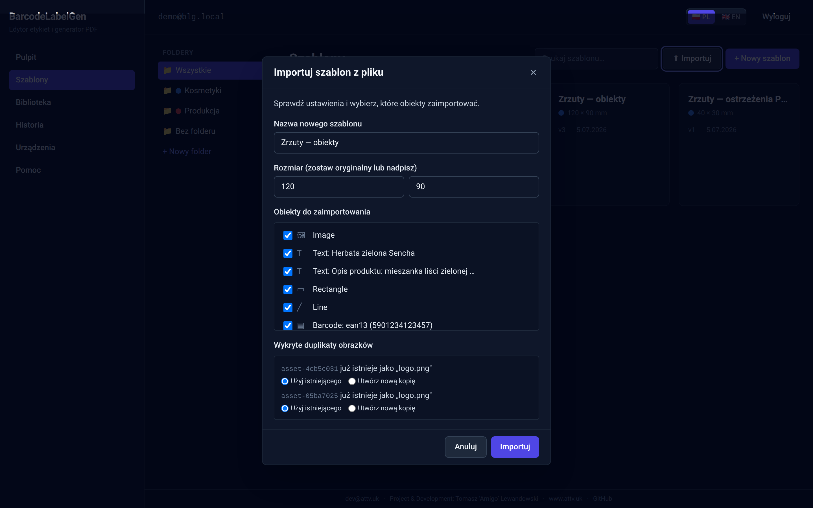

3. Kliknij **Importuj** — program tworzy nowy szablon i otwiera go w edytorze.

### Typowe sytuacje, w których się to przydaje

- **Backup przed dużą zmianą** — wyeksportuj, zostaw plik w archiwum, edytuj bez obaw. Jeśli coś pójdzie nie tak — zaimportuj z powrotem.
- **Kopiowanie układu na inny rozmiar** — wyeksportuj, zaimportuj z nadpisanym rozmiarem (np. ta sama etykieta w wersji na A6 i na 100×50 mm).
- **Przeniesienie szablonu między instalacjami** (np. testowa → produkcyjna) — wyeksportuj po jednej stronie, zaimportuj po drugiej.
- **Wybiórczy import** — bierzesz np. tylko układ kodu kreskowego i 2-3 pola z gotowego szablonu, resztę odznaczasz.

### Limity i bezpieczeństwo

- Maksymalnie 20 MB plik, 50 obiektów, 20 obrazków (po 5 MB każdy).
- Obrazki są weryfikowane specjalną sumą kontrolną (**sha256** — cyfrowy „odcisk palca" pliku, który potwierdza, że nie został zmieniony). Pliki, które ktoś ręcznie zmodyfikował, są odrzucane.
- Nowy szablon zawsze trafia na Twoje konto, niezależnie od tego, kto wyeksportował plik.

## 9. Skróty klawiaturowe

| Skrót | Akcja |
|---|---|
| Ctrl/Cmd + S | Zapisz |
| Ctrl/Cmd + Z | Cofnij |
| Ctrl/Cmd + Shift + Z | Ponów |
| Ctrl/Cmd + A | Zaznacz wszystko (w canvasie) |
| Ctrl/Cmd + D | Duplikuj zaznaczone (przesunięcie +5 mm) |
| Alt + przeciąganie | Duplikuj zaznaczone pod kursorem |
| Delete / Backspace | Usuń zaznaczone |
| Shift + klik | Dodaj do zaznaczenia |

---

## 10. Wsparcie

Programem zarządza **Tomasz „Amigo" Lewandowski** — kontakt: dev@attv.uk · www.attv.uk.

Kod źródłowy: github.com/AmigoUK/BarcodeLabelGen
