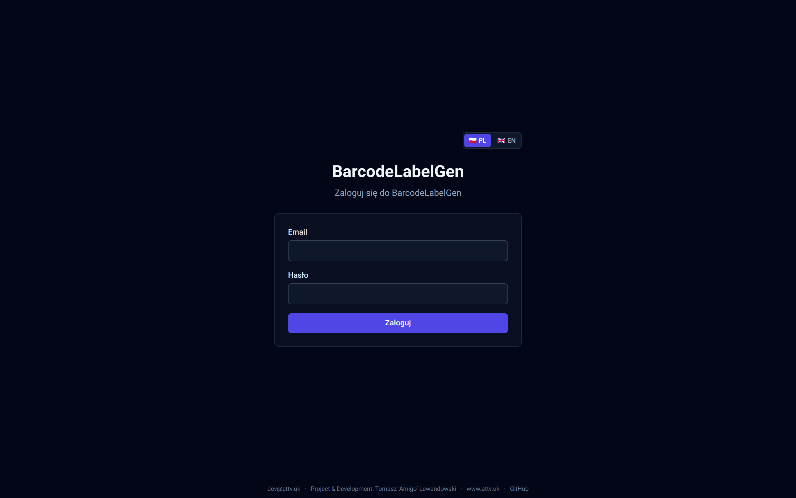
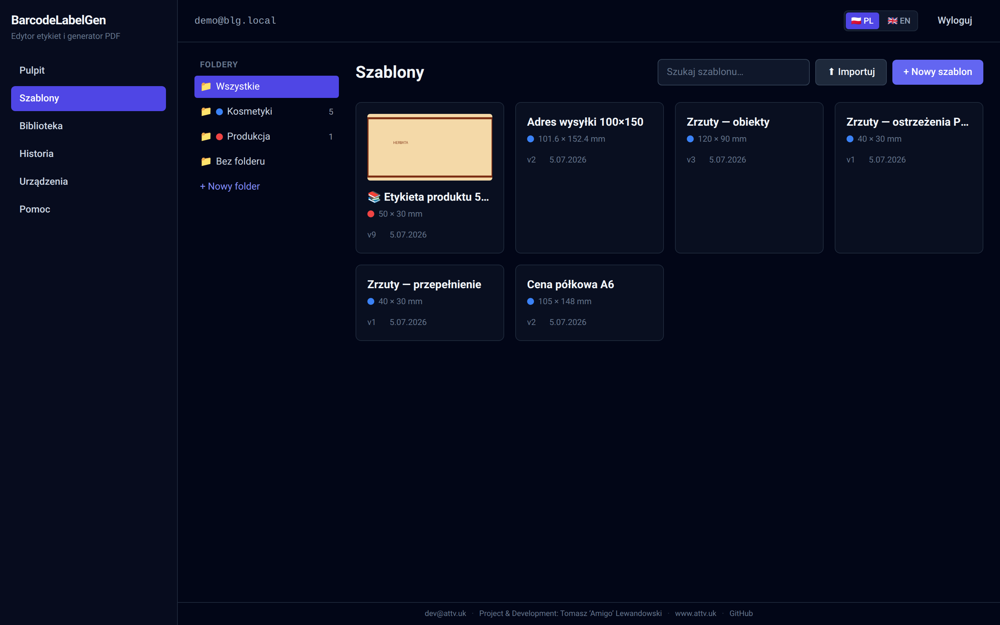
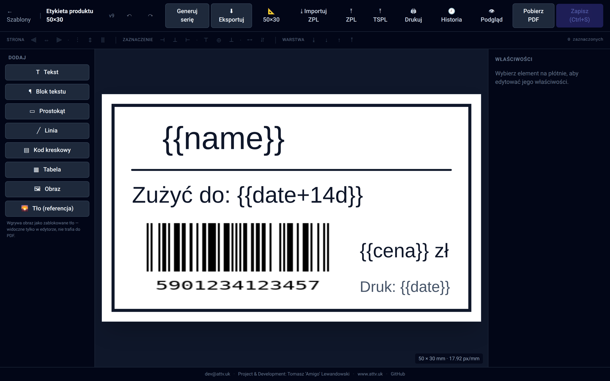
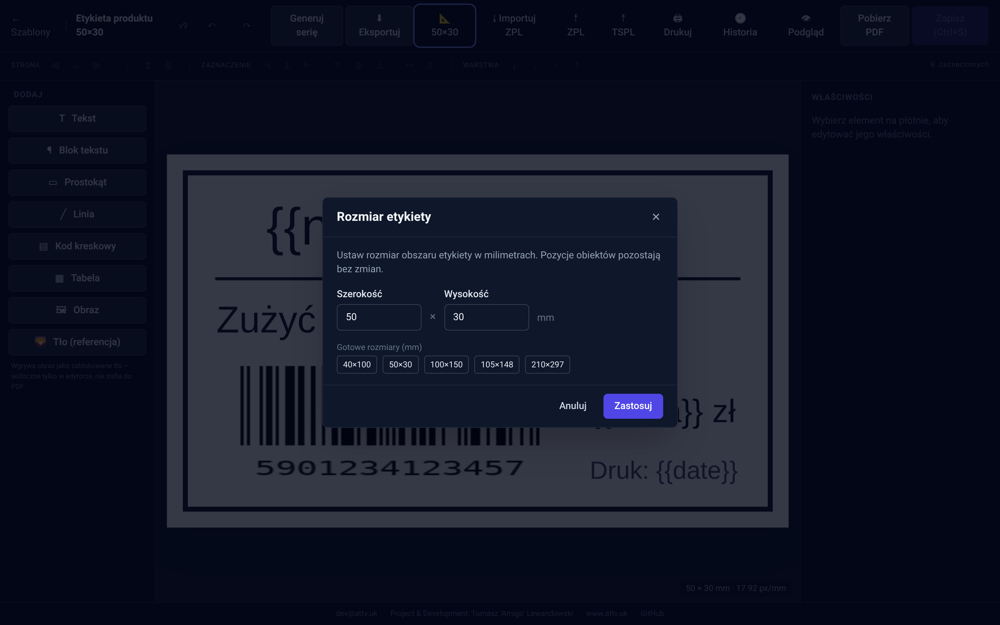
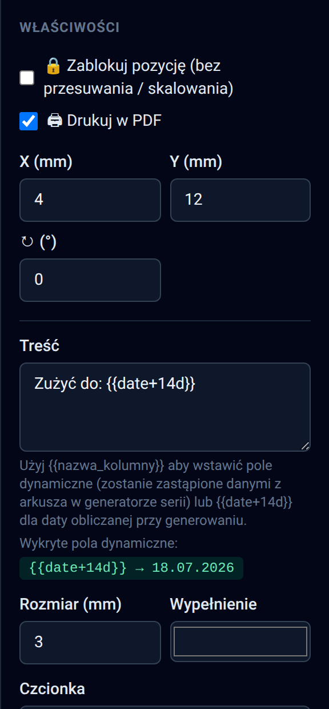
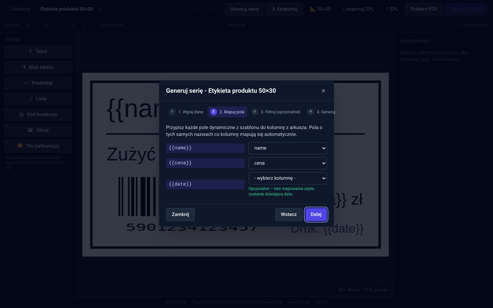
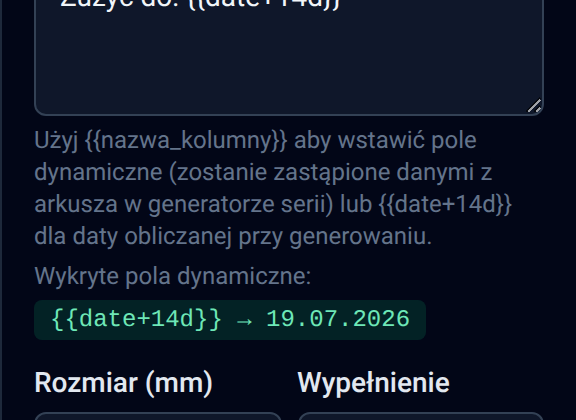
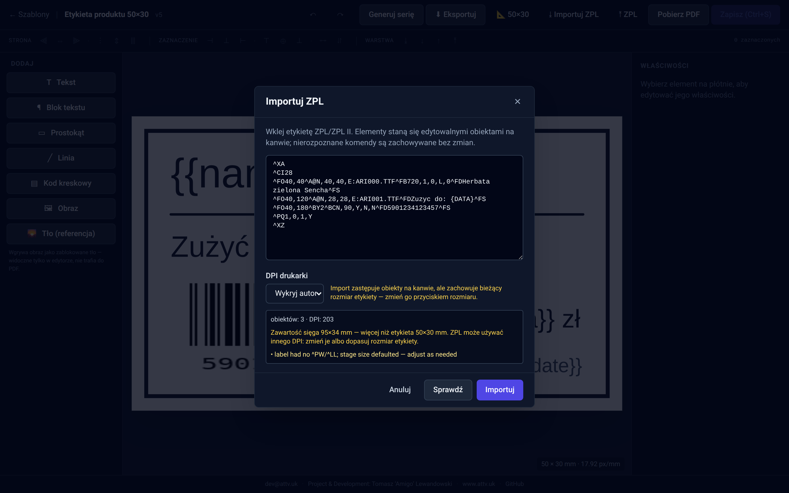
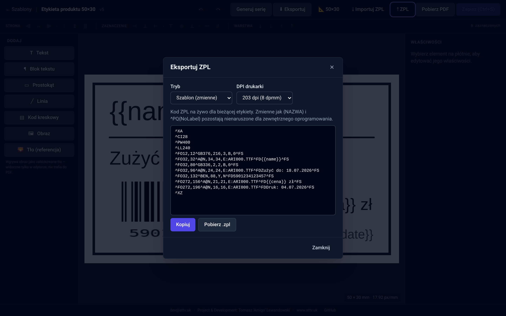
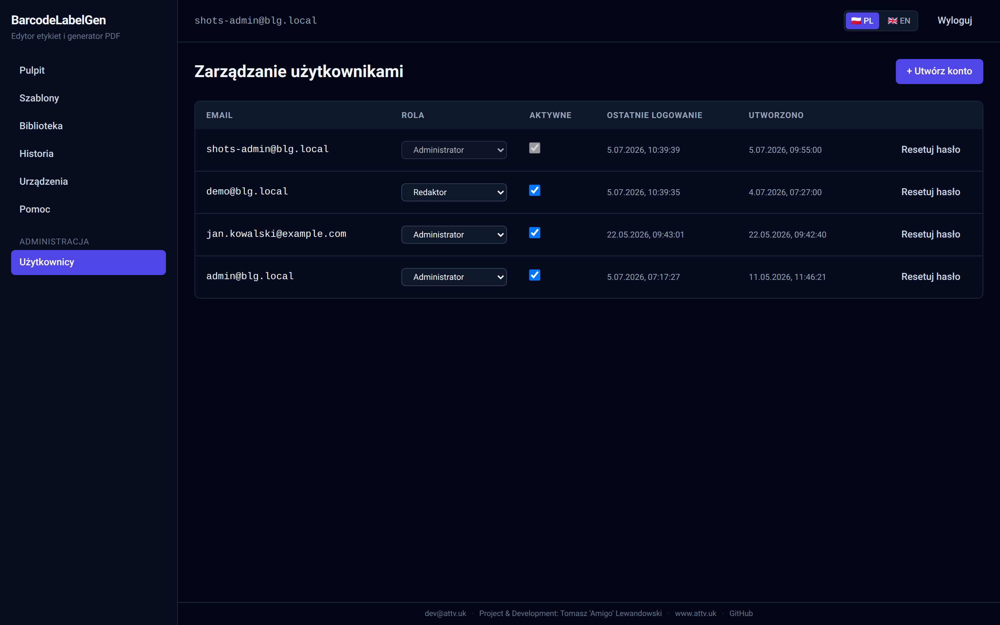

# BarcodeLabelGen — Pomoc

Krótki przewodnik po programie. Czytaj sekcjami, w kolejności, albo skacz od razu do interesującego cię feature'u.

---

## 1. Pierwsze kroki

### Logowanie

1. Otwórz adres aplikacji w przeglądarce.
2. Wpisz email i hasło, które dał ci administrator.
3. Przy pierwszym logowaniu program poprosi cię o ustawienie własnego hasła (min. 10 znaków). To jednorazowe — kolejne logowania od razu pokazują panel.



*kadr: formularz Email + Hasło z przyciskiem „Zaloguj" i przełącznikiem języka PL/EN w prawym górnym rogu.*

### Pulpit

Po zalogowaniu trafiasz na **Pulpit**. To tylko ekran powitalny — żeby zacząć pracę kliknij **Szablony** w lewym menu.

### Tworzenie pierwszego szablonu

1. **Szablony** → **Nowy szablon**.
2. Wpisz nazwę (np. "Cennik produktów").
3. Wybierz format etykiety:
   - **Predefiniowane** — gotowe rozmiary (A4, Zebra 2×1″ itd.).
   - **Własny rozmiar** — wpisz szerokość i wysokość w mm i wybierz orientację.
4. Klik **Utwórz** — otwiera się edytor.

---

## 2. Menu i nawigacja

### Lewe menu (sidebar)

| Pozycja | Co tu znajdziesz |
|---|---|
| **Pulpit** | Ekran startowy. |
| **Szablony** | Twoje szablony w folderach + przyciski *Nowy szablon* i *Importuj*. |
| **Biblioteka** | Gotowe projekty na start + szablony udostępnione przez innych (sekcja 2a). |
| **Urządzenia** | Konektory druku i Inbox przechwyconych etykiet (sekcja 7a). |
| **Pomoc** | Ten przewodnik + FAQ, bez wychodzenia z programu. |
| **Administracja → Użytkownicy** | (tylko admin) zarządzanie kontami. |

W nagłówku po prawej: twój email, przełącznik języka **PL/EN** i przycisk **Wyloguj**.



*kadr: strona Szablony z kilkoma kafelkami, polem wyszukiwania oraz przyciskami „Importuj" i „Nowy szablon" w prawym górnym rogu.*

### Edytor — układ ekranu

Po otwarciu szablonu widzisz:

- **Toolbar (góra)** — Zapisz, Cofnij/Ponów, autozapis, **Generuj serię**, **⬇ Eksportuj** (plik szablonu), **📐 rozmiar etykiety**, **⤓ Importuj ZPL**, **⤒ ZPL** (eksport), **Pobierz PDF**.
- **Lewy panel (Dodaj)** — przyciski wstawiania obiektów na etykietę.
- **Canvas (środek)** — twoja etykieta w skali 1:1 (mm).
- **Pasek wyrównania (nad canvasem)** — wyrównywanie i kolejność warstw.
- **Prawy panel (Właściwości)** — ustawienia zaznaczonego obiektu.



*kadr: cały edytor z otwartym szablonem; podpisane strzałkami: toolbar, panel Dodaj, canvas, pasek wyrównania, panel Właściwości.*

### Pasek wyrównania — co która grupa robi

- **Strona** — wyrównuje obiekt do krawędzi/środka strony.
- **Zaznaczenie** — wyrównuje obiekty względem siebie (potrzebne ≥2 zaznaczone).
- **Warstwa** — zmienia kolejność (przód/tył) zaznaczonych obiektów.
- **Rozłóż** (3+ obiektów) — równe odstępy w poziomie/pionie.

Każda ikona ma podpowiedź (najedź myszką).

---

## 2a. Foldery, Biblioteka i udostępnianie

### Foldery — porządek we własnych szablonach

Na stronie **Szablony** po lewej masz pasek folderów: **Wszystkie**, Twoje foldery (z licznikami) i **Bez folderu**. Foldery są **prywatne** — każdy użytkownik ma swoje.

- **Nowy folder** — przycisk na dole paska.
- **Przenoszenie**: najedź na kafelek szablonu → **⚙** → wybierz folder → Zapisz.
- **Edycja (✎)** — zmiana nazwy i **kolor folderu** (paleta 8 kolorów): kolorowa kropka pojawia się przy folderze na pasku i na kafelkach jego szablonów.
- **Usunięcie (✕)** — **nie kasuje szablonów**, wracają do „Bez folderu".

### Biblioteka — gotowe projekty i szablony od innych

Pozycja **Biblioteka** w menu ma dwie sekcje:

- **Gotowe projekty** — wbudowane startery (etykieta produktu z EAN i datą, adres wysyłki, cena półkowa, termin przydatności, etykieta magazynowa z QR, naklejka inwentarzowa).
- **Od użytkowników** — szablony, które inni udostępnili (widać autora).

Przycisk **„Użyj"** zawsze tworzy **Twoją własną kopię** i otwiera ją w edytorze — oryginału nie da się zepsuć.

### Udostępnianie własnego szablonu

Szablony → najedź na kafelek → **⚙** → zaznacz **„Udostępnij w Bibliotece"**. W tym samym oknie możesz też wgrać **grafikę wyróżniającą** — obrazek podglądowy pokazywany na kafelku listy i w Bibliotece. Od tej chwili wszyscy zalogowani widzą go w Bibliotece i mogą sklonować; **edytujesz tylko Ty**. Udostępniony szablon ma na liście ikonę 📚. Odznacz, aby wycofać z Biblioteki.

---

## 3. Tworzenie etykiety — przewodnik po obiektach

Wszystkie poniższe są w **lewym panelu**, sekcja *Dodaj*.

### T — Tekst

**Co robi:** Pojedyncza linia tekstu o stałym rozmiarze.
**Kiedy:** Etykiety / nagłówki / krótkie napisy.
**Jak:** Klik **T Tekst**, potem zaznacz na canvasie i edytuj treść w prawym panelu.

### ¶ — Blok tekstu

**Co robi:** Wieloliniowy tekst, który automatycznie zawija się w ramce; opcjonalnie *auto-skalowanie* zmniejsza/zwiększa font żeby się zmieścił.
**Kiedy:** Opisy produktu o zmiennej długości (idealne do `{{description}}` ze spreadsheetu).
**Jak:** Klik **¶ Blok tekstu**. W prawym panelu zaznacz **Auto-skalowanie** i ustaw min/max font.

### ▭ — Prostokąt, ╱ — Linia

**Co robi:** Geometria pomocnicza (ramki, separatory).
**Jak:** Klik → przeciągnij w canvasie żeby zmienić rozmiar; ustaw kolor/obrys w prawym panelu.

### ▤ — Kod kreskowy

**Co robi:** Generuje kod kreskowy z podanej wartości.
**Kiedy:** Każdy katalog produktów z kodem.
**Jak:** Klik **▤ Kod kreskowy**, w prawym panelu wybierz typ (EAN-13, Code128 itd.) i wpisz dane. Możesz wpisać `{{sku}}` żeby wartość pobrać z arkusza.

### ▦ — Tabela

**Co robi:** Siatka wierszy×kolumn z tekstem w komórkach — do etykiet typu cecha–wartość, wartości odżywcze, mini-lista pozycji.
**Jak:** Klik **▦ Tabela**. W prawym panelu ustaw liczbę wierszy/kolumn, wpisz treść komórek (możesz używać `{{kolumna}}` i `{{date+x}}` — pod siatką pojawiają się chipy), ustaw szerokości kolumn w mm, font i ramkę. Zaznacz **Pogrubiony nagłówek**, aby wyróżnić pierwszy wiersz.
**Druk:** tabela renderuje się natywnie w PDF i jest emitowana jako natywny ZPL (ramka `^GB` + tekst komórek). Uwaga: obrót tabeli nie jest wspierany w ZPL (eksportuje się bez obrotu).

### 🖼 — Obraz

**Co robi:** Wgrywa PNG/JPG/SVG i wstawia na canvas. Drukuje się w PDF.
**Kiedy:** Logo, ilustracje, ikony, zdjęcia produktu.
**Jak:** Klik **🖼 Obraz** → wybierz plik. Maks 5 MB.

### 🌄 — Tło (referencja)

**Co robi:** Wgrywa obraz jako **zablokowane tło na cały rozmiar etykiety**, które jest **widoczne tylko w edytorze, ale NIE drukuje się w PDF**.
**Kiedy:** Etykiety przyszły z drukarni z już wydrukowanym logo. Skanujesz wzór, wgrywasz jako tło, ustawiasz tekst pasujący do logo, generujesz PDF — drukarka dodrukowuje tylko nowy tekst, logo się nie dubluje.
**Jak:** Klik **🌄 Tło**, wybierz plik. Tło ląduje na samym dole stosu, zablokowane (bez uchwytów). Żeby zmienić: zaznacz, w prawym panelu odznacz **Zablokuj pozycję** lub zaznacz **Drukuj w PDF**.

---

## 4. Praca z obiektami

### Zaznaczanie

- Pojedynczy klik = zaznacz jeden.
- **Shift + klik** = dodaj do zaznaczenia (multi-select).
- **Ctrl/Cmd + A** = zaznacz wszystko.

### Przesuwanie i skalowanie

- Przeciągaj zaznaczony obiekt myszką.
- Uchwyty na rogach = skalowanie; uchwyt nad obiektem = obrót.
- Obiekt **zablokowany** nie ma uchwytów — ale dalej można go zaznaczyć żeby odblokować w prawym panelu.

### Cofanie

- **Ctrl/Cmd + Z** = cofnij.
- **Ctrl/Cmd + Shift + Z** lub **Ctrl/Cmd + Y** = ponów.

Jedna operacja = jeden krok historii (np. wyrównanie 5 obiektów cofa się jednym Ctrl+Z).

### Duplikowanie

Dwa szybkie sposoby zrobienia kopii zaznaczonego obiektu (lub całego multi-selectu):

- **Alt + przeciąganie** — przytrzymaj **Alt** (lub **Option** na Mac) i przeciągnij zaznaczony obiekt. Oryginał zostaje w miejscu, klon ląduje pod kursorem w momencie puszczenia myszki. Multi-select zachowuje względne pozycje — przeciągnij jeden z 3 zaznaczonych, dostaniesz 3 klony w nowej lokalizacji.
- **Ctrl/Cmd + D** — duplikuje zaznaczone "w miejscu" z drobnym przesunięciem (+5 mm w prawo i w dół). Selekcja od razu skacze na klony, więc kolejne Ctrl+D buduje schodek kopii w prawo-w-dół.

Klon dziedziczy wszystko: font, kolor, rotację, flagi *Zablokuj* / *Drukuj w PDF*, a obrazy współdzielą ten sam Asset (jedna binarka → wiele obiektów). Pełne duplikowanie multi-selectu cofniesz jednym Ctrl+Z.

### Kolejność warstw (z-order)

W **pasku wyrównania**, grupa **Warstwa**:

- ⤓ **Na sam dół** — wsadź zaznaczone pod resztę.
- ↓ **Niżej** — przesuń o jedno pod sąsiada.
- ↑ **Wyżej** — przesuń o jedno nad sąsiada.
- ⤒ **Na sam wierzch** — nad wszystko.

Multi-select zachowuje względną kolejność zaznaczonych.

### Lock + Drukuj w PDF (prawy panel)

Każdy obiekt ma na górze prawego panelu dwa checkboxy:

- **🔒 Zablokuj pozycję** — wyłącza przesuwanie i skalowanie (ale dalej można edytować font, kolor itd.).
- **🖨 Drukuj w PDF** — domyślnie zaznaczone. Odznaczone = obiekt widać tylko w edytorze, w PDF się nie pojawi (renderer go pomija). Obiekty nie-drukowane są wyblakłe (50% przezroczystości) żebyś od razu widział.

### Autozapis

Edytor sam zapisuje co kilka sekund. Status w toolbarze:
- **Niezapisane zmiany** — coś jest do zapisania.
- **Autozapis…** — w trakcie wysyłania.
- **Autozapisano 12:34** — ostatni zapis.

Możesz też ręcznie kliknąć **Zapisz**.

### Zmiana rozmiaru etykiety

Rozmiar ustawiony przy tworzeniu szablonu **można zmienić w każdej chwili**: w toolbarze kliknij przycisk **📐 {szerokość}×{wysokość}**.

- Wpisz nową szerokość i wysokość w mm (1–1000), albo kliknij jeden z gotowych presetów (40×100, 50×30, 100×150, 105×148, 210×297).
- Obiekty **nie są przeskalowywane** — zachowują pozycje w mm. Po zmniejszeniu etykiety elementy poza krawędzią po prostu przesuwasz z powrotem.



*kadr: modal z polami Szerokość/Wysokość i rzędem presetów-chipów; kursor nad przyciskiem „Zastosuj".*

---

## 5. Pobieranie PDF — pojedyncza etykieta

W toolbarze edytora kliknij **Pobierz PDF**. Renderowanie jest synchroniczne (kilka sekund), plik PDF zaczyna się ściągać.

Jeśli któryś tekst nie zmieścił się w bloku, zobaczysz chip **N ostrzeżeń** — najedź żeby zobaczyć szczegóły.

Placeholdery kolumn (`{{name}}`) w pojedynczym PDF zostają jako tekst — dane podmienia dopiero generowanie serii. **Placeholdery daty** (`{{date+14d}}`, patrz sekcja 7) są natomiast obliczane także tutaj.

---

## 6. Generowanie serii — wiele etykiet z jednego szablonu

To główny feature programu. Pozwala wygenerować np. 200 etykiet z jednego szablonu, gdzie każda dostaje inne dane z arkusza/bazy.

### Krok 0 — przygotowanie szablonu

Wstaw w Text lub Barcode placeholder w postaci `{{nazwa_kolumny}}`, np.:
- Text: `{{name}}`
- Barcode data: `{{sku}}`

Każde wystąpienie zostanie podmienione wartością z odpowiedniej kolumny.



*kadr: prawy panel Właściwości z polem tekstowym zawierającym `{{name}}` i `{{date+14d}}`; poniżej dwa chipy — fioletowy `{{name}}` i zielony `{{date+14d}} → 18.07.2026`.*

### Krok 1 — Wgraj dane

Toolbar → **Generuj serię** → Krok 1 (Wgraj dane).

Akceptowane formaty:

| Format | Maks rozmiar | Maks wierszy |
|---|---|---|
| `.csv` | 10 MB | 1000 |
| `.xls` / `.xlsx` | 10 MB | 1000 |
| `.db` / `.sqlite` / `.sqlite3` | 50 MB | 1000 (na zapytanie) |

#### CSV / Excel

Plik trafia na serwer i od razu jest parsowany. Widzisz kolumny i liczbę wierszy. Klik **Dalej**.

#### SQLite

Po uploadzie program pokazuje **listę tabel** (posortowane: najpierw te z największą liczbą wierszy). Wybierz tabelę z danymi i kliknij **Użyj tego źródła**.

Jeśli potrzebujesz filtrowania na poziomie SQL (np. tylko produkty z konkretnej kategorii, lub JOIN dwóch tabel), rozwiń **Pokaż zaawansowane** i wpisz zapytanie SELECT, np.:

```sql
SELECT sku, name, price
FROM products
WHERE category = 'labels' AND price > 0
```

**Bezpieczeństwo:** Połączenie jest read-only. Akceptowany jest tylko pojedynczy SELECT — `INSERT`, `UPDATE`, `DELETE`, `DROP`, `ATTACH`, `PRAGMA` są blokowane. Maksymalnie 1000 wierszy w wyniku — większe odrzucone z prośbą o `WHERE`/`LIMIT`.

### Krok 2 — Mapowanie pól

Program wykrywa wszystkie placeholdery `{{...}}` z szablonu. Jeśli nazwa placeholdera == nazwa kolumny, mapowanie wstawia się automatycznie. Jeśli różne — wybierz ręcznie z listy.

### Krok 3 — Filtr (opcjonalny)

Możesz odsiać wiersze przed generowaniem, np. *price > 10* albo *category contains "tea"*. Klik **Sprawdź filtr** pokazuje ile wierszy się załapie. Pomiń ten krok jeśli chcesz wszystkie.



*kadr: krok 2 kreatora z listą placeholderów po lewej i selectami kolumn po prawej; przy `{{date}}` widoczna zielona podpowiedź „Opcjonalne — bez mapowania użyta zostanie dzisiejsza data".*

### Krok 4 — Generuj PDF

Klik **Generuj PDF**. Powstaje zadanie w tle, pasek pokazuje postęp. Po zakończeniu PDF ściąga się automatycznie.

Jeśli któreś etykiety mają teksty nie mieszczące się w blokach, zobaczysz listę ostrzeżeń (które wiersze, które obiekty) — PDF i tak powstaje.

---

## 7. Placeholdery daty — `{{date+…}}`

Oprócz kolumn z arkusza możesz wstawiać **daty liczone automatycznie w momencie generowania** — idealne do terminów przydatności („zużyć do") i dat produkcji. Działają wszędzie: w pojedynczym PDF, w serii i w eksporcie ZPL.

### Składnia

| Wpisujesz | Dostajesz (przy generowaniu 04.07.2026) |
|---|---|
| `{{date}}` | 04.07.2026 (dzisiejsza data) |
| `{{date+14d}}` | 18.07.2026 (+14 dni) |
| `{{date-7d}}` | 27.06.2026 (−7 dni) |
| `{{date+3m}}` | 04.10.2026 (+3 miesiące) |
| `{{date+1y}}` | 04.07.2027 (+1 rok) |
| `{{date+14d:DD/MM/YY}}` | 18/07/26 (własny format) |
| `{{date+3m:YYYY-MM-DD}}` | 2026-10-04 |

- Jednostki przesunięcia: **d** = dni, **m** = miesiące, **y** = lata; działa `+` i `-`.
- Format (opcjonalnie, po dwukropku) składasz z klocków **DD**, **MM**, **YY**, **YYYY** — separatory (kropki, ukośniki, myślniki, spacje) przechodzą bez zmian. Bez formatu dostajesz `DD.MM.YYYY`.
- Koniec miesiąca jest bezpieczny: 31 stycznia + 1 miesiąc = 28/29 lutego (nie „31 lutego").

### Skąd wiesz, że zadziała?

Po wpisaniu placeholdera w prawym panelu pojawia się **zielony chip z podglądem obliczonej daty** (fioletowe chipy to zwykłe kolumny z arkusza). Najedź na chip — tooltip przypomina, że finalna wartość liczy się przy generowaniu.



*kadr: zbliżenie na prawy panel; pole Treść z `{{date+14d}}` i zielony chip `{{date+14d}} → 18.07.2026` pod spodem.*

### Dobrze wiedzieć

- **Kolumna o nazwie `date`** w arkuszu ma pierwszeństwo dla gołego `{{date}}` — formy z przesunięciem (`{{date+14d}}`) zawsze liczą się automatycznie.
- Data liczy się **w momencie generowania PDF/ZPL**, według czasu serwera — nie w momencie zapisania szablonu.
- W kreatorze serii pola datowe **nie wymagają mapowania** na kolumnę.

---

## 7a. ZPL — drukarki etykiet Zebra

**ZPL** to język drukarek etykiet (Zebra i zgodne). Program potrafi w obie strony: zaimportować istniejącą etykietę ZPL do edytora i wyeksportować twój projekt jako ZPL.

### Import ZPL

Toolbar → **⤓ Importuj ZPL**.

1. Wklej kod ZPL (np. z innego systemu albo od dostawcy etykiet).
2. Wybierz **DPI drukarki** — jeśli nie wiesz, zostaw **Wykryj automatycznie** (program porówna wymiary z kodu z rozmiarem twojej etykiety).
3. Klik **Sprawdź** — zobaczysz liczbę rozpoznanych obiektów i wykryte DPI; jeśli etykieta z kodu jest większa niż twoja, dostaniesz podpowiedź.
4. Klik **Importuj** — obiekty lądują na canvasie. **Uwaga:** import zastępuje obecną zawartość etykiety.

Zmienne drukarkowe w pojedynczych klamrach (np. `{NAZWA}`) przechodzą bez zmian, a polecenia, których edytor nie modeluje, są zachowywane i wracają przy eksporcie.



*kadr: modal z wklejonym kodem ZPL, selektem DPI ustawionym na „Wykryj automatycznie" i wynikiem analizy „12 obiektów · 203 dpi".*

### Eksport ZPL

Toolbar → **⤒ ZPL**. Dwa tryby:

- **Szablon (zmienne)** — jeden kod ZPL z twojego projektu; placeholdery kolumn `{{...}}` zostają w kodzie (podmienisz je we własnym systemie), a **placeholdery daty są od razu obliczone**. Przyciski **Kopiuj** i **Pobierz .zpl**.
- **Wsad (dataset)** — wybierz wgrany wcześniej plik danych, a program wygeneruje jeden plik `.zpl` z etykietą dla każdego wiersza (podmienione i kolumny, i daty).

Wybierz DPI zgodne z twoją drukarką (203 lub 300).



*kadr: modal w trybie „Szablon (zmienne)" z podglądem wygenerowanego kodu i przyciskami Kopiuj / Pobierz .zpl.*

### Druk bezpośredni — konektor

Zamiast pobierać plik `.zpl`, możesz drukować **prosto z edytora** przyciskiem **🖨 Drukuj**:

1. Na komputerze w sieci z drukarkami zainstaluj agenta **blg-connector** (binarka w Assets każdego wydania na GitHubie; konfiguracja: `connector/README.md`).
2. W aplikacji: **Urządzenia → Dodaj urządzenie** → skopiuj token do `config.yaml` agenta. Urządzenie przejdzie na **Online** i zgłosi listę drukarek.
3. W edytorze: **🖨 Drukuj** → wybierz urządzenie, drukarkę, liczbę kopii i DPI → **Drukuj**. Okno pokaże postęp: *w kolejce → agent odebrał → wydrukowano* (lub błąd z powodem).

**Szybka ścieżka:** jeśli konektor działa **na tym samym komputerze**, na którym otwarta jest przeglądarka, dialog wykryje go automatycznie i pokaże opcję **⚡ Ten komputer — druk natychmiastowy** (domyślnie wybraną) — etykieta idzie wtedy prosto na drukarkę, bez rundy przez serwer.

Placeholdery daty są obliczane w momencie druku; placeholdery kolumn zostają w kodzie (druk pojedynczej etykiety, nie serii).

### Wirtualna drukarka — przejmij etykiety z innych programów

Konektor potrafi też działać **w drugą stronę**: udaje drukarkę sieciową, a wszystko, co inne aplikacje (ERP, Word, stary program magazynowy) na nią wydrukują, trafia do **Inboxa** na stronie **Urządzenia**.

1. W `config.yaml` agenta włącz sekcję `capture` (instrukcja krok po kroku, razem z konfiguracją drukarki w Windows: `connector/README.md`).
2. Wydrukuj coś z dowolnej aplikacji na tę wirtualną drukarkę.
3. **Urządzenia → Inbox** → **Otwórz w edytorze** — etykieta staje się normalnym szablonem: rozmiar wykryty z kodu, teksty i kody kreskowe edytowalne.

Z Inboxa możesz też skopiować surowy kod ZPL albo usunąć wpis. Program przechowuje maksymalnie 200 ostatnich przechwyceń na urządzenie.

---

## 8. Administracja (tylko admin)

Lewe menu → **Administracja → Użytkownicy**.



*kadr: tabela użytkowników z kolumnami Email / Rola / Aktywne / Ostatnie logowanie i przyciskiem „Utwórz konto" u góry.*

### Tworzenie użytkownika

1. Klik **Utwórz konto**.
2. Wpisz email + hasło tymczasowe (min. 10 znaków, możesz wygenerować losowe).
3. Wybierz rolę:
   - **Administrator** — pełny dostęp + zarządzanie użytkownikami.
   - **Edytor** — tworzy/edytuje swoje szablony i dataset'y.
   - **Tylko podgląd** — może otwierać i podglądać, ale nie zapisuje.
4. Po kliknięciu *Utwórz* program pokaże hasło tymczasowe **tylko raz** — przekaż je użytkownikowi.

### Reset hasła

Klik **Resetuj hasło** przy koncie → wygeneruj nowe tymczasowe → przekaż użytkownikowi. Przy następnym logowaniu zostanie zmuszony je zmienić.

### Aktywacja / dezaktywacja

Toggle **Aktywne** w wierszu użytkownika. Nie możesz dezaktywować własnego konta (zabezpieczenie).

---

## 8a. Import / eksport szablonów

Każdy szablon możesz zapisać jako jeden plik `.blg-template.json` (rozmiar etykiety + pozycje wszystkich obiektów + ich treść + obrazki zakodowane w pliku). Plik jest przenośny: zarchiwizujesz go, wyślesz mailem albo zaimportujesz na drugiej instancji BarcodeLabelGen.

### Eksport

Dwa miejsca:
- **Szablony** → najedź na kafelek szablonu → ikona **⬇** w prawym dolnym rogu.
- W edytorze → toolbar → przycisk **⬇ Eksportuj** (obok *Pobierz PDF*).

Pobiera się plik `<nazwa>.blg-template.json` — najlepiej trzymaj go w katalogu backupów.

### Import

**Szablony** → **⬆ Importuj** otwiera 2-krokowe okno:

1. **Wybór pliku** — podaj `.blg-template.json`. Program sprawdza poprawność i pokazuje podgląd.
2. **Konfiguracja** — możesz:
   - zmienić **nazwę** nowego szablonu (domyślnie nazwa z pliku; jeśli kolizja → automatyczny suffix „(kopia)"),
   - **nadpisać rozmiar** (puste = oryginalny),
   - **odznaczyć obiekty** które nie mają zostać zaimportowane (czeklista — każdy obiekt z ikoną typu i preview treści),
   - dla każdego **duplikatu obrazka** wybrać: *Użyj istniejącego* (oszczędność miejsca) lub *Utwórz nową kopię*.

Klik **Importuj** → tworzy nowy szablon i otwiera go w edytorze.

### Typowe przypadki użycia

- **Backup przed dużą zmianą** — eksportuj, zostaw plik w archiwum, edytuj swobodnie. Coś poszło źle → reimportuj.
- **Klonowanie układu na inny rozmiar** — eksport, import z nadpisanym rozmiarem (np. ta sama etykieta dla A6 i 100×50 mm).
- **Przeniesienie szablonu między instancjami** (dev → prod) — eksport po jednej stronie, import po drugiej.
- **Wybiórczy import** — bierzesz układ kodu kreskowego + 2-3 pola z gotowego szablonu, resztę odznaczasz.

### Limity i bezpieczeństwo

- Maks. 20 MB plik, 50 obiektów, 20 obrazków (5 MB każdy).
- Obrazki są weryfikowane: sha256 musi się zgadzać z zawartością base64. Pliki manipulowane są odrzucane.
- Nowy szablon zawsze trafia do twojego konta (niezależnie kto wyeksportował plik).

## 9. Skróty klawiaturowe

| Skrót | Akcja |
|---|---|
| Ctrl/Cmd + S | Zapisz |
| Ctrl/Cmd + Z | Cofnij |
| Ctrl/Cmd + Shift + Z | Ponów |
| Ctrl/Cmd + A | Zaznacz wszystko (w canvasie) |
| Ctrl/Cmd + D | Duplikuj zaznaczone (offset +5 mm) |
| Alt + przeciąganie | Duplikuj zaznaczone pod kursorem |
| Delete / Backspace | Usuń zaznaczone |
| Shift + klik | Dodaj do zaznaczenia |

---

## 10. Wsparcie

Programem zarządza **Tomasz "Amigo" Lewandowski** — kontakt: dev@attv.uk · www.attv.uk.

Kod źródłowy: github.com/AmigoUK/BarcodeLabelGen
